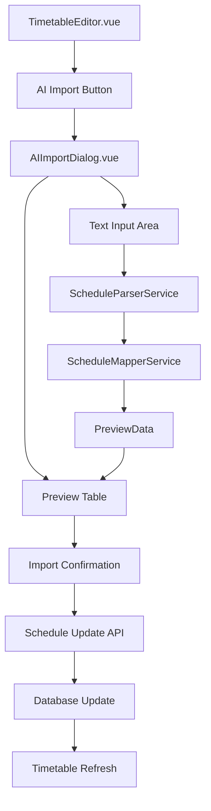

# Design Document

## Overview

The AI Schedule Import System is designed as a seamless enhancement to the existing Timetable Editor within the weekly system. The feature adds an intelligent import dialog that can parse various text formats and automatically map schedule data to existing database structures. The design emphasizes user experience, data validation, and integration with the current Laravel/Vue.js architecture.

## Architecture

### High-Level Architecture

The system follows the existing weekly system architecture pattern:

```
Vue.js Dialog Component → Laravel API Controller → Parser Service → Schedule Mapper → Database Update
```

### Integration Points

1. **Frontend Integration**: New Vue component integrated into existing TimetableEditor.vue
2. **Backend Integration**: New API endpoints following existing weekly system patterns
3. **Database Integration**: Uses existing schedule tables and CST relationships
4. **Service Layer**: New parsing and mapping services following Laravel service patterns

### Component Flow Diagram



## Components and Interfaces

### Frontend Components

#### AIImportDialog.vue
**Purpose**: Main modal dialog for AI schedule import functionality

**Props**:
- `modelValue: Boolean` - Dialog visibility state
- `selectedClassroom: Object` - Current classroom context
- `activeCopy: Object` - Active schedule copy

**Events**:
- `update:modelValue` - Dialog visibility changes
- `import-complete` - Successful import completion
- `import-error` - Import error occurred

**Key Features**:
- Large text area for schedule data input
- Format examples and instructions
- Real-time parsing feedback
- Preview table with validation indicators
- Import confirmation buttons

#### SchedulePreviewTable.vue
**Purpose**: Display parsed schedule data with validation feedback

**Props**:
- `previewData: Array` - Parsed schedule entries
- `validationErrors: Array` - Validation issues
- `cstOptions: Array` - Available CST assignments

**Features**:
- Editable cells for corrections
- Dropdown selectors for CST assignments
- Validation status indicators
- Conflict highlighting

#### Enhanced TimetableEditor.vue
**Modifications**:
- Add "AI Import" button to the toolbar
- Import AIImportDialog component
- Handle import completion events
- Refresh grid after successful import

### Backend Components

#### AIScheduleImportController
**Purpose**: Handle AI import API requests

**Endpoints**:
```php
POST /weekly-system/api/ai-import/parse
POST /weekly-system/api/ai-import/preview  
POST /weekly-system/api/ai-import/execute
```

**Methods**:
- `parseScheduleText()` - Parse input text and return structured data
- `previewImport()` - Generate preview with validation
- `executeImport()` - Apply validated schedule changes

#### ScheduleParserService
**Purpose**: Parse various text formats into structured schedule data

**Key Methods**:
```php
public function parseText(string $text): array
public function parseTableFormat(string $text): array
public function parseNaturalLanguage(string $text): array
public function validateParsedData(array $data): array
```

**Parsing Strategies**:
1. **Table Format Detection**: Identify pipe-separated, CSV, or markdown tables
2. **Natural Language Processing**: Extract subjects and days from conversational text
3. **Format Normalization**: Clean and standardize parsed data
4. **Validation**: Check against system constraints

#### ScheduleMapperService
**Purpose**: Map parsed data to existing database structures

**Key Methods**:
```php
public function mapToCST(array $scheduleData, int $classroomId): array
public function findSubjectMatches(string $subjectName): array
public function resolveConflicts(array $mappedData): array
public function generatePreview(array $mappedData): array
```

**Mapping Logic**:
1. **Subject Matching**: Fuzzy matching against existing subjects
2. **CST Resolution**: Find appropriate classroom-subject-teacher assignments
3. **Conflict Detection**: Identify scheduling conflicts
4. **Preview Generation**: Create user-friendly preview data

### API Design

#### Parse Schedule Text Endpoint
```php
POST /weekly-system/api/ai-import/parse
Content-Type: application/json

{
    "text": "Sunday: Math, Arabic, Science\nMonday: Islamic, Capstone, ICT",
    "classroom_id": 123,
    "copy_id": 456
}

Response:
{
    "success": true,
    "data": {
        "parsed_entries": [
            {
                "day": "Sunday",
                "day_number": 1,
                "subject": "Math",
                "period": null,
                "confidence": 0.95
            }
        ],
        "validation_errors": [],
        "suggestions": []
    }
}
```

#### Preview Import Endpoint
```php
POST /weekly-system/api/ai-import/preview
Content-Type: application/json

{
    "parsed_entries": [...],
    "classroom_id": 123,
    "copy_id": 456
}

Response:
{
    "success": true,
    "data": {
        "preview_entries": [
            {
                "day": "Sunday",
                "day_number": 1,
                "period_number": 1,
                "subject_name": "Mathematics",
                "cst_options": [
                    {
                        "id": 789,
                        "teacher_name": "John Smith",
                        "subject_name": "Mathematics"
                    }
                ],
                "conflicts": [],
                "validation_status": "valid"
            }
        ],
        "summary": {
            "total_entries": 15,
            "valid_entries": 12,
            "entries_with_conflicts": 2,
            "entries_needing_cst": 1
        }
    }
}
```

#### Execute Import Endpoint
```php
POST /weekly-system/api/ai-import/execute
Content-Type: application/json

{
    "preview_entries": [...],
    "classroom_id": 123,
    "copy_id": 456,
    "import_options": {
        "overwrite_existing": true,
        "skip_conflicts": false
    }
}

Response:
{
    "success": true,
    "data": {
        "imported_count": 12,
        "skipped_count": 2,
        "error_count": 1,
        "errors": [
            {
                "entry": {...},
                "error": "No CST assignment found for subject"
            }
        ]
    }
}
```

## Data Models

### Parsed Schedule Entry Structure
```php
class ParsedScheduleEntry
{
    public string $day;
    public int $day_number;
    public string $subject;
    public ?int $period;
    public float $confidence;
    public array $metadata;
}
```

### Preview Entry Structure
```php
class PreviewEntry
{
    public string $day;
    public int $day_number;
    public int $period_number;
    public string $subject_name;
    public array $cst_options;
    public array $conflicts;
    public string $validation_status; // 'valid', 'warning', 'error'
    public ?string $error_message;
}
```

### Import Result Structure
```php
class ImportResult
{
    public int $imported_count;
    public int $skipped_count;
    public int $error_count;
    public array $errors;
    public array $warnings;
}
```

## Correctness Properties

*A property is a characteristic or behavior that should hold true across all valid executions of a system-essentially, a formal statement about what the system should do. Properties serve as the bridge between human-readable specifications and machine-verifiable correctness guarantees.*

### Property Reflection

After analyzing all acceptance criteria, I identified several areas where properties can be consolidated:

- **Parsing Properties**: Multiple parsing format properties (2.1, 2.2, 7.1, 7.2) can be combined into comprehensive parsing properties
- **Validation Properties**: Various validation criteria (2.4, 2.5, 4.3) can be unified under validation consistency
- **UI Interaction Properties**: Dialog behavior and preview functionality can be consolidated
- **Database Operation Properties**: Import and update operations share common patterns

### Core Properties

**Property 1: Dialog interaction consistency**
*For any* timetable editor state with a selected classroom, clicking the AI Import button should open a dialog that displays the classroom context and contains a text input area
**Validates: Requirements 1.2, 1.4**

**Property 2: Table format parsing universality**
*For any* valid table format (pipe-separated, CSV, markdown), the Schedule_Parser should extract day and subject information correctly and return structured data
**Validates: Requirements 2.1, 2.2, 2.3, 7.1, 7.2**

**Property 3: Data validation consistency**
*For any* parsed schedule data, validation should reject invalid day names and flag unrecognized subjects consistently across all input formats
**Validates: Requirements 2.4, 2.5, 4.3**

**Property 4: Natural language extraction accuracy**
*For any* natural language input containing subject and day references, the parser should extract separate schedule entries for each subject-day combination
**Validates: Requirements 3.1, 3.3**

**Property 5: Preview data completeness**
*For any* successfully parsed schedule data, the preview should display all entries with validation status, conflict indicators, and available CST options
**Validates: Requirements 4.1, 4.2, 5.3, 5.5**

**Property 6: Subject mapping consistency**
*For any* recognized subject name, the Schedule_Mapper should find matching database subjects and return appropriate CST assignments for the selected classroom
**Validates: Requirements 5.1, 5.2**

**Property 7: Import operation atomicity**
*For any* confirmed import operation, the system should either successfully create/update all valid schedule records or provide detailed error information for failed entries while preserving existing data
**Validates: Requirements 6.1, 6.2, 6.3, 6.5**

**Property 8: UI refresh consistency**
*For any* successful import operation, the timetable grid should refresh to display the updated schedule data immediately
**Validates: Requirements 6.4, 8.5**

**Property 9: Format flexibility**
*For any* text input with extra whitespace or mixed formatting, the parser should clean and normalize the data to extract valid schedule information
**Validates: Requirements 7.3, 7.5**

**Property 10: Error handling consistency**
*For any* parsing or import error, the system should provide helpful error messages using the existing notification system
**Validates: Requirements 7.4, 8.4**

<function_calls>
<invoke name="prework">
<parameter name="featureName">ai-schedule-import

## Error Handling

### Frontend Error Handling

**Input Validation**:
- Real-time feedback for empty or invalid text input
- Format detection with helpful suggestions
- Preview validation with clear error indicators

**API Error Handling**:
- Network error recovery with retry mechanisms
- Graceful degradation when parsing services are unavailable
- User-friendly error messages for API failures

**Import Error Handling**:
- Partial import support with detailed success/failure reporting
- Rollback capability for failed batch operations
- Conflict resolution interface for scheduling conflicts

### Backend Error Handling

**Parsing Errors**:
- Structured error responses with specific format suggestions
- Confidence scoring for ambiguous parsing results
- Fallback parsing strategies for unrecognized formats

**Validation Errors**:
- Detailed validation messages with correction suggestions
- Batch validation with individual entry error reporting
- Database constraint violation handling

**Import Errors**:
- Transaction rollback for database operation failures
- Detailed error logging for debugging and monitoring
- Graceful handling of concurrent schedule modifications

## Testing Strategy

### Dual Testing Approach

The AI Schedule Import system requires both unit tests and property-based tests to ensure comprehensive coverage:

**Unit Tests**: Focus on specific examples, edge cases, and integration points
- Dialog component rendering and interaction
- API endpoint responses with known data
- Error handling with specific invalid inputs
- Integration with existing timetable editor functionality

**Property-Based Tests**: Verify universal properties across all inputs
- Parsing behavior with randomly generated table formats
- Validation consistency across various input types
- Subject matching accuracy with diverse subject names
- Import operation integrity with different data combinations

### Property-Based Testing Configuration

- **Testing Library**: Use Laravel's built-in testing with custom property test helpers
- **Minimum Iterations**: 100 iterations per property test
- **Test Tagging**: Each property test tagged with format: **Feature: ai-schedule-import, Property {number}: {property_text}**

### Testing Categories

**Parser Testing**:
- Table format recognition across multiple formats
- Natural language extraction with various phrasings
- Data cleaning and normalization with messy inputs
- Validation accuracy with known valid/invalid data

**Mapper Testing**:
- Subject matching with fuzzy string matching
- CST assignment resolution with various classroom configurations
- Conflict detection with overlapping schedules
- Preview generation with complex data structures

**Integration Testing**:
- End-to-end import workflow with real database data
- UI component interaction with backend services
- Error propagation through the full stack
- Performance testing with large schedule datasets

**Regression Testing**:
- Existing timetable editor functionality remains unchanged
- Import operations don't break existing schedule data
- UI consistency with existing weekly system components
- API compatibility with existing endpoints

### Test Data Management

**Synthetic Data Generation**:
- Random table format generation for parser testing
- Realistic subject and day name variations
- Edge case data for boundary testing
- Performance test data with large datasets

**Test Database Setup**:
- Isolated test database with known CST assignments
- Predictable classroom and subject configurations
- Conflict scenarios for testing resolution logic
- Clean state management between test runs