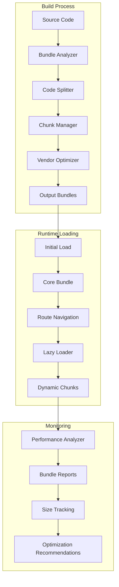

# Design Document: JavaScript Bundle Optimization

## Overview

This design outlines a comprehensive approach to optimizing JavaScript bundle size in a Laravel + Vue.js educational management system. The current 2.4MB bundle will be reduced through strategic code splitting, manual chunking, vendor optimization, and lazy loading techniques. The solution leverages Vite's build system with Rollup under the hood to implement modern bundling strategies that improve initial page load performance while maintaining application functionality.

The optimization strategy focuses on reducing the initial bundle size by at least 40% through dynamic imports, creating efficient chunk distribution, and implementing intelligent caching strategies. The design ensures compatibility with the existing Laravel asset pipeline while providing comprehensive monitoring and analysis capabilities.

## Architecture

### High-Level Architecture



### Component Architecture

The optimization system consists of five main components working together:

1. **Bundle Analyzer**: Analyzes current bundle composition and identifies optimization opportunities
2. **Code Splitter**: Implements dynamic imports and route-based code splitting
3. **Chunk Manager**: Configures manual chunking strategies for optimal distribution
4. **Vendor Optimizer**: Optimizes third-party dependencies and creates efficient vendor chunks
5. **Performance Monitor**: Tracks bundle performance and provides ongoing optimization insights

## Components and Interfaces

### Bundle Analyzer Component

**Purpose**: Analyzes bundle composition and identifies optimization opportunities

**Key Methods**:
- `analyzeBundleComposition()`: Generates detailed bundle analysis reports
- `identifyLargeModules()`: Identifies modules exceeding size thresholds
- `calculateOptimizationPotential()`: Estimates potential size reduction
- `generateRecommendations()`: Provides actionable optimization suggestions

**Dependencies**: rollup-plugin-visualizer, bundle analysis utilities

**Configuration**:
```javascript
// Bundle analysis configuration
const analyzerConfig = {
  outputFile: 'bundle-analysis.html',
  template: 'treemap', // or 'sunburst', 'network'
  gzipSize: true,
  brotliSize: true,
  open: true
}
```

### Code Splitter Component

**Purpose**: Implements dynamic imports and route-based code splitting

**Key Methods**:
- `implementDynamicImports()`: Converts static imports to dynamic imports
- `createRouteChunks()`: Splits routes into separate chunks
- `configureChunkNames()`: Sets up meaningful chunk naming conventions
- `optimizeImportStrategy()`: Determines optimal splitting strategy

**Route Splitting Strategy**:
```javascript
// Dynamic import implementation for educational modules
const routes = [
  {
    path: '/students',
    component: () => import(/* webpackChunkName: "student-management" */ '@/modules/students/StudentModule.vue')
  },
  {
    path: '/teachers',
    component: () => import(/* webpackChunkName: "teacher-tools" */ '@/modules/teachers/TeacherModule.vue')
  },
  {
    path: '/quizzes',
    component: () => import(/* webpackChunkName: "quiz-system" */ '@/modules/quizzes/QuizModule.vue')
  },
  {
    path: '/behavior',
    component: () => import(/* webpackChunkName: "behavior-tracking" */ '@/modules/behavior/BehaviorModule.vue')
  }
]
```

### Chunk Manager Component

**Purpose**: Manages manual chunking configuration for optimal bundle distribution

**Key Methods**:
- `configureManualChunks()`: Sets up manual chunking rules
- `optimizeChunkSizes()`: Ensures chunks stay within size limits
- `groupRelatedModules()`: Groups related functionality together
- `balanceChunkDistribution()`: Balances chunk sizes for optimal loading

**Chunking Strategy**:
```javascript
// Manual chunking configuration
const chunkingStrategy = {
  // Vendor chunks
  'vendor-core': ['vue', 'vue-router', 'pinia'],
  'vendor-ui': ['@headlessui/vue', 'heroicons'],
  'vendor-utils': ['lodash', 'axios', 'date-fns'],
  
  // Feature chunks
  'student-management': ['@/modules/students/**'],
  'teacher-tools': ['@/modules/teachers/**'],
  'quiz-system': ['@/modules/quizzes/**'],
  'behavior-tracking': ['@/modules/behavior/**'],
  
  // Shared chunks
  'shared-components': ['@/components/shared/**'],
  'shared-utils': ['@/utils/**', '@/composables/**']
}
```

### Vendor Optimizer Component

**Purpose**: Optimizes third-party dependencies and vendor chunking

**Key Methods**:
- `analyzeVendorDependencies()`: Analyzes vendor library usage
- `createVendorChunks()`: Creates optimized vendor chunks
- `implementTreeShaking()`: Removes unused vendor code
- `optimizeCacheStrategy()`: Configures vendor caching

**Vendor Optimization Strategy**:
- Separate stable libraries (Vue, Vue Router) from frequently updated ones
- Group related libraries together (UI libraries, utility libraries)
- Implement aggressive tree shaking for large libraries
- Configure long-term caching for vendor chunks

### Performance Monitor Component

**Purpose**: Monitors bundle performance and tracks optimization effectiveness

**Key Methods**:
- `measureBundleSize()`: Tracks bundle size metrics over time
- `analyzeLoadingPerformance()`: Measures loading performance impact
- `generatePerformanceReports()`: Creates performance analysis reports
- `trackOptimizationGoals()`: Monitors progress toward optimization targets

**Monitoring Metrics**:
- Total bundle size (before/after optimization)
- Individual chunk sizes
- Loading performance (FCP, LCP, TTI)
- Cache hit rates
- User experience metrics

## Data Models

### Bundle Analysis Model

```typescript
interface BundleAnalysis {
  totalSize: {
    raw: number;
    gzipped: number;
    brotli: number;
  };
  chunks: ChunkInfo[];
  modules: ModuleInfo[];
  dependencies: DependencyInfo[];
  optimizationOpportunities: OptimizationOpportunity[];
  generatedAt: Date;
}

interface ChunkInfo {
  name: string;
  size: number;
  gzippedSize: number;
  modules: string[];
  loadPriority: 'critical' | 'high' | 'medium' | 'low';
}

interface ModuleInfo {
  path: string;
  size: number;
  chunk: string;
  importType: 'static' | 'dynamic';
  dependencies: string[];
}
```

### Optimization Configuration Model

```typescript
interface OptimizationConfig {
  codesplitting: {
    enabled: boolean;
    strategy: 'route-based' | 'feature-based' | 'hybrid';
    chunkSizeLimit: number;
  };
  manualChunks: Record<string, string[]>;
  vendorOptimization: {
    separateVendors: boolean;
    vendorChunks: Record<string, string[]>;
    treeShaking: boolean;
  };
  lazyLoading: {
    routes: boolean;
    components: boolean;
    preloadStrategy: 'aggressive' | 'conservative' | 'none';
  };
}
```

### Performance Metrics Model

```typescript
interface PerformanceMetrics {
  bundleSize: {
    before: number;
    after: number;
    reduction: number;
    reductionPercentage: number;
  };
  loadingMetrics: {
    firstContentfulPaint: number;
    largestContentfulPaint: number;
    timeToInteractive: number;
    totalBlockingTime: number;
  };
  chunkMetrics: {
    totalChunks: number;
    averageChunkSize: number;
    largestChunk: number;
    cacheHitRate: number;
  };
}
```

Now I need to use the prework tool to analyze the acceptance criteria before writing the Correctness Properties section:

## Correctness Properties

*A property is a characteristic or behavior that should hold true across all valid executions of a system—essentially, a formal statement about what the system should do. Properties serve as the bridge between human-readable specifications and machine-verifiable correctness guarantees.*

The following properties define the correctness requirements for the JavaScript bundle optimization system. Each property represents a universal rule that must hold across all valid inputs and execution scenarios.

### Property 1: Dynamic Import Module Identification
*For any* JavaScript codebase with identifiable module boundaries, the Code_Splitter should correctly identify all modules suitable for dynamic imports based on usage patterns and dependency analysis.
**Validates: Requirements 1.1**

### Property 2: Non-Blocking Dynamic Loading
*For any* dynamically imported module, the loading process should never block the main JavaScript thread, ensuring responsive user interaction during module loading.
**Validates: Requirements 1.2, 4.1**

### Property 3: Bundle Size Reduction Target
*For any* optimized bundle, the main bundle size should be reduced by at least 40% compared to the original unoptimized bundle while maintaining all functionality.
**Validates: Requirements 1.3**

### Property 4: Functional Preservation
*For any* application feature that worked before optimization, the same feature should work identically after optimization, ensuring no functionality is lost during the optimization process.
**Validates: Requirements 1.4, 7.3**

### Property 5: Module Boundary Chunking
*For any* application with clearly defined module boundaries (student management, teacher tools, quiz system, behavior tracking), each module should be placed in its own separate chunk.
**Validates: Requirements 1.5**

### Property 6: Vendor Dependency Separation
*For any* set of vendor dependencies, stable libraries should be separated from frequently updated libraries, and related libraries should be grouped together for optimal caching.
**Validates: Requirements 2.1, 2.2, 3.2**

### Property 7: Chunk Size Constraints
*For any* generated chunk after minification, the size should not exceed 1MB, ensuring optimal loading performance across different network conditions.
**Validates: Requirements 2.5**

### Property 8: Tree Shaking Effectiveness
*For any* vendor library with unused exports, the tree shaking process should remove all unused code, resulting in smaller bundle sizes without affecting functionality.
**Validates: Requirements 3.4**

### Property 9: Lazy Loading Coverage
*For any* route component in the Educational Management System, it should be loaded using dynamic imports rather than static imports, ensuring comprehensive lazy loading implementation.
**Validates: Requirements 4.2**

### Property 10: Loading Indicator Display
*For any* lazy-loaded component, appropriate loading indicators should be displayed during the loading process, providing user feedback during dynamic imports.
**Validates: Requirements 4.3**

### Property 11: Bundle Analysis Completeness
*For any* bundle analysis report, it should contain detailed information about chunk sizes, dependencies, and optimization opportunities, providing comprehensive insights for further optimization.
**Validates: Requirements 5.1, 5.3**

### Property 12: Performance Metrics Tracking
*For any* optimization process, the system should accurately measure and report performance metrics including FCP, LCP, and total size reduction achieved.
**Validates: Requirements 5.2, 7.1, 7.2**

### Property 13: Build System Integration
*For any* existing Laravel + Vue.js build process, the optimization should integrate seamlessly without breaking existing functionality while applying all optimization strategies in production mode.
**Validates: Requirements 6.1, 6.3, 6.5**

### Property 14: Development Performance Preservation
*For any* development build, rebuild times should remain within acceptable thresholds (under 5 seconds for incremental builds) even with optimization configurations enabled.
**Validates: Requirements 6.2**

### Property 15: Performance Budget Enforcement
*For any* bundle that exceeds defined size thresholds, the monitoring system should trigger alerts and prevent deployment, ensuring performance budgets are enforced.
**Validates: Requirements 7.4, 7.5**

## Error Handling

### Build-Time Error Handling

**Dynamic Import Resolution Failures**:
- When dynamic imports cannot be resolved, provide clear error messages with module paths
- Implement fallback strategies for critical modules that fail to load dynamically
- Generate build warnings for modules that cannot be optimally split

**Chunk Size Violations**:
- When chunks exceed size limits, automatically attempt to split them further
- Provide detailed reports on which modules are causing size violations
- Implement progressive splitting strategies for oversized chunks

**Vendor Dependency Conflicts**:
- Detect and resolve version conflicts in vendor chunks
- Handle circular dependencies that prevent optimal chunking
- Provide warnings for suboptimal vendor groupings

### Runtime Error Handling

**Dynamic Loading Failures**:
- Implement retry mechanisms for failed dynamic imports (up to 3 attempts)
- Provide graceful degradation when chunks fail to load
- Display user-friendly error messages for persistent loading failures
- Implement offline detection and appropriate fallback behavior

**Cache Invalidation Issues**:
- Handle cache invalidation when new versions are deployed
- Detect version mismatches between cached and current chunks
- Implement automatic cache clearing for critical failures

**Network-Related Errors**:
- Handle slow network conditions with appropriate timeouts
- Implement progressive loading strategies for poor connections
- Provide offline indicators and retry mechanisms

### Monitoring and Recovery

**Performance Regression Detection**:
- Continuously monitor bundle sizes and alert on regressions
- Track performance metrics and detect degradation
- Implement automatic rollback mechanisms for severe performance issues

**Analysis Tool Failures**:
- Handle bundle analysis tool failures gracefully
- Provide alternative analysis methods when primary tools fail
- Ensure optimization can proceed even with limited analysis data

## Testing Strategy

### Dual Testing Approach

The testing strategy employs both unit testing and property-based testing to ensure comprehensive coverage:

**Unit Tests**: Focus on specific examples, edge cases, and error conditions including:
- Specific module splitting scenarios
- Known vendor dependency configurations  
- Integration points with Laravel asset pipeline
- Error handling for common failure modes

**Property Tests**: Verify universal properties across all inputs including:
- Bundle size constraints across different codebases
- Functional preservation across optimization scenarios
- Performance characteristics across various network conditions
- Chunking strategies across different application structures

### Property-Based Testing Configuration

**Testing Framework**: Use `fast-check` for JavaScript property-based testing with minimum 100 iterations per property test.

**Test Tagging**: Each property test must reference its design document property using the format:
`// Feature: js-bundle-optimization, Property {number}: {property_text}`

**Property Test Implementation Requirements**:
- Property 1: Generate various codebase structures and verify module identification accuracy
- Property 3: Test bundle size reduction across different application sizes and complexities  
- Property 7: Generate chunks of various sizes and verify size constraint enforcement
- Property 9: Test lazy loading implementation across different route configurations
- Property 15: Test performance budget enforcement across various threshold configurations

### Integration Testing

**Laravel Integration Tests**:
- Verify compatibility with Laravel Mix and Vite configurations
- Test asset compilation pipeline integration
- Validate production deployment processes

**End-to-End Performance Tests**:
- Measure actual loading performance in browser environments
- Test optimization effectiveness across different device types
- Validate user experience metrics (FCP, LCP, TTI)

**Regression Testing**:
- Automated bundle size monitoring in CI/CD pipeline
- Performance benchmark comparisons across builds
- Functional regression testing after optimization changes

### Testing Environment Setup

**Development Testing**:
- Local bundle analysis and optimization testing
- Fast feedback loops for optimization configuration changes
- Mock network conditions for loading performance testing

**Staging Testing**:
- Full optimization pipeline testing with production-like data
- Performance testing with realistic user scenarios
- Integration testing with complete Laravel application stack

**Production Monitoring**:
- Real-user monitoring (RUM) for performance metrics
- Bundle size tracking and alerting
- Error monitoring for dynamic loading failures