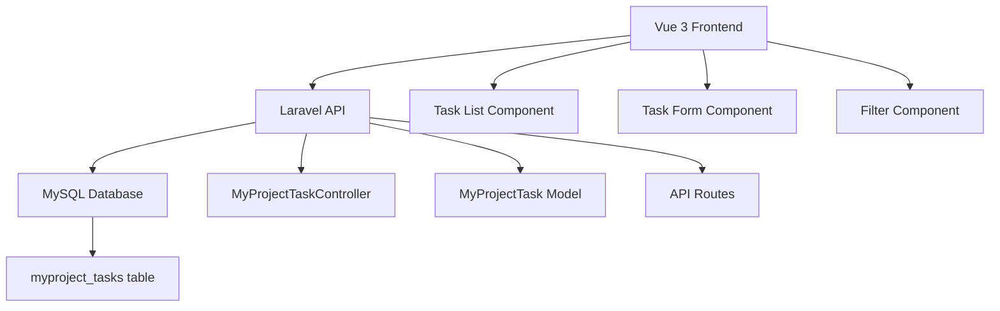

# Design Document

## Overview

The MyProject Tasks system is designed as a modern web application using Laravel 12 as the backend API and Vue 3 with Composition API as the frontend. The system follows RESTful API principles and implements a clean separation between backend and frontend concerns.

## Architecture

### System Architecture


### Technology Stack
- **Backend**: Laravel 12, MySQL 8.0
- **Frontend**: Vue 3 (Composition API), Axios
- **Styling**: Tailwind CSS
- **API**: RESTful JSON API

## Components and Interfaces

### Backend Components

#### Database Schema
```sql
CREATE TABLE myproject_tasks (
    id BIGINT UNSIGNED AUTO_INCREMENT PRIMARY KEY,
    title VARCHAR(255) NOT NULL,
    description TEXT,
    status ENUM('pending', 'in_progress', 'completed') DEFAULT 'pending',
    priority ENUM('low', 'medium', 'high') DEFAULT 'medium',
    due_date DATE,
    created_at TIMESTAMP NULL DEFAULT NULL,
    updated_at TIMESTAMP NULL DEFAULT NULL,
    INDEX idx_status (status),
    INDEX idx_priority (priority),
    INDEX idx_due_date (due_date)
);
```

#### API Endpoints
```
GET    /api/myproject_tasks          - List tasks with filters
POST   /api/myproject_tasks          - Create new task
GET    /api/myproject_tasks/{id}     - Show single task
PUT    /api/myproject_tasks/{id}     - Update task
DELETE /api/myproject_tasks/{id}     - Delete task
```

#### Query Parameters for Filtering
- `status`: Filter by task status (pending, in_progress, completed)
- `priority`: Filter by priority (low, medium, high)
- `search`: Search in title and description
- `sort_by`: Column to sort by (title, status, priority, due_date, created_at)
- `sort_direction`: Sort direction (asc, desc)
- `page`: Page number for pagination
- `per_page`: Items per page (default: 10)

### Frontend Components

#### Component Structure
```
developer/myproject_tasks/
├── TaskManager.vue          # Main container component
├── components/
│   ├── TaskList.vue         # Task table display
│   ├── TaskForm.vue         # Create/edit form
│   ├── TaskFilters.vue      # Filter controls
│   └── TaskPagination.vue   # Pagination controls
└── composables/
    └── useTasks.js          # Task management logic
```

#### Component Responsibilities

**TaskManager.vue**
- Main container and state management
- Coordinates between child components
- Handles routing and modal management

**TaskList.vue**
- Displays tasks in a sortable table
- Handles row actions (edit, delete)
- Shows loading states

**TaskForm.vue**
- Form for creating and editing tasks
- Client-side validation
- Handles form submission

**TaskFilters.vue**
- Filter controls (status, priority, search)
- Real-time filter updates
- Clear filters functionality

**TaskPagination.vue**
- Page navigation controls
- Items per page selection
- Page information display

## Data Models

### MyProjectTask Model
```php
class MyProjectTask extends Model
{
    protected $fillable = [
        'title',
        'description', 
        'status',
        'priority',
        'due_date'
    ];

    protected $casts = [
        'due_date' => 'date',
        'status' => 'string',
        'priority' => 'string'
    ];

    // Validation rules
    public static $rules = [
        'title' => 'required|string|max:255',
        'description' => 'nullable|string',
        'status' => 'required|in:pending,in_progress,completed',
        'priority' => 'required|in:low,medium,high',
        'due_date' => 'nullable|date|after_or_equal:today'
    ];
}
```

### Frontend Data Structure
```javascript
// Task object structure
const task = {
    id: Number,
    title: String,
    description: String,
    status: 'pending' | 'in_progress' | 'completed',
    priority: 'low' | 'medium' | 'high',
    due_date: String, // ISO date format
    created_at: String,
    updated_at: String
}

// Filter state structure
const filters = {
    status: String | null,
    priority: String | null,
    search: String,
    sort_by: String,
    sort_direction: 'asc' | 'desc',
    page: Number,
    per_page: Number
}
```

## Error Handling

### Backend Error Responses
```json
{
    "success": false,
    "message": "Error description",
    "errors": {
        "field_name": ["Validation error message"]
    }
}
```

### Frontend Error Handling
- Network errors: Display connection error messages
- Validation errors: Highlight form fields and show messages
- API errors: Show error notifications with details
- Loading states: Show spinners during API calls

### Error Scenarios
1. **Network Connectivity**: Retry mechanism with user notification
2. **Validation Errors**: Field-level error display
3. **Server Errors**: Generic error message with option to retry
4. **Not Found**: Redirect to task list with notification

## Testing Strategy

### Backend Testing
- **Unit Tests**: Model validation, controller methods
- **Feature Tests**: API endpoint functionality
- **Database Tests**: Migration and seeding

### Frontend Testing
- **Component Tests**: Individual component functionality
- **Integration Tests**: Component interaction
- **E2E Tests**: Complete user workflows

### Test Scenarios
1. **CRUD Operations**: Create, read, update, delete tasks
2. **Filtering**: All filter combinations work correctly
3. **Sorting**: Column sorting maintains filters
4. **Pagination**: Navigation preserves state
5. **Validation**: Form validation prevents invalid submissions
6. **Error Handling**: Proper error display and recovery

## Performance Considerations

### Database Optimization
- Indexes on frequently queried columns (status, priority, due_date)
- Efficient pagination using LIMIT/OFFSET
- Query optimization for filtering and sorting

### Frontend Optimization
- Debounced search input to reduce API calls
- Efficient re-rendering with Vue's reactivity
- Lazy loading for large datasets
- Caching of filter options

### API Optimization
- Consistent response format
- Appropriate HTTP status codes
- Efficient query building with Eloquent
- Response compression for large datasets

## Security Considerations

### Backend Security
- Input validation and sanitization
- SQL injection prevention through Eloquent ORM
- CSRF protection for state-changing operations
- Rate limiting on API endpoints

### Frontend Security
- XSS prevention through Vue's built-in escaping
- Input validation before API submission
- Secure handling of user input
- Proper error message display without exposing sensitive data

## User Interface Design

### Layout Structure
```
┌─────────────────────────────────────┐
│ Task Management Header              │
├─────────────────────────────────────┤
│ Filters: [Status] [Priority] [Search] │
├─────────────────────────────────────┤
│ Task Table                          │
│ ┌─────┬────────┬────────┬─────────┐ │
│ │Title│Status  │Priority│Due Date │ │
│ ├─────┼────────┼────────┼─────────┤ │
│ │...  │...     │...     │...      │ │
│ └─────┴────────┴────────┴─────────┘ │
├─────────────────────────────────────┤
│ Pagination Controls                 │
└─────────────────────────────────────┘
```

### Visual Design Elements
- **Status Badges**: Color-coded status indicators
- **Priority Icons**: Visual priority indicators
- **Action Buttons**: Edit and delete actions
- **Loading States**: Skeleton loaders and spinners
- **Responsive Design**: Mobile-friendly layout

### Interaction Patterns
- **Click to Sort**: Column headers are clickable
- **Inline Actions**: Edit/delete buttons in table rows
- **Modal Forms**: Task creation/editing in modals
- **Real-time Filters**: Immediate filter application
- **Keyboard Navigation**: Tab navigation support