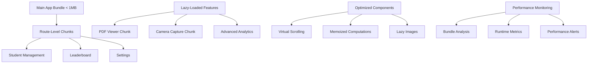

# Design Document

## Overview

This design document outlines a comprehensive performance optimization strategy for a Quasar-based educational management system. The optimization focuses on reducing bundle sizes, implementing efficient code splitting, optimizing Vue component performance, and improving user experience across all devices, particularly mobile.

The current system suffers from a 3MB PDF viewer chunk and inefficient component rendering patterns. Our approach will implement lazy loading, code splitting, component optimization, and modern bundling techniques to achieve significant performance improvements.

## Architecture

### High-Level Architecture



### Bundle Splitting Strategy

1. **Core Bundle**: Essential app shell, routing, and basic components
2. **Route Chunks**: Page-level components loaded on navigation
3. **Feature Chunks**: Heavy functionality (PDF viewer, camera) loaded on-demand
4. **Vendor Chunks**: Third-party libraries grouped by usage patterns

## Components and Interfaces

### Bundle Optimization Components

#### BundleAnalyzer
- **Purpose**: Analyze and report bundle composition
- **Interface**: 
  ```typescript
  interface BundleAnalyzer {
    generateReport(): BundleReport
    checkThresholds(): PerformanceAlert[]
    identifyDuplicates(): DuplicateReport
  }
  ```

#### LazyComponentLoader
- **Purpose**: Dynamically load components when needed
- **Interface**:
  ```typescript
  interface LazyComponentLoader {
    loadComponent(name: string): Promise<Component>
    preloadComponent(name: string): void
    unloadComponent(name: string): void
  }
  ```

### Performance-Optimized Vue Components

#### VirtualizedStudentList
- **Purpose**: Efficiently render large student lists
- **Interface**:
  ```typescript
  interface VirtualizedStudentList {
    itemHeight: number
    visibleRange: { start: number, end: number }
    renderItem(index: number): VNode
  }
  ```

#### OptimizedStudentCard
- **Purpose**: Memoized student card with lazy image loading
- **Interface**:
  ```typescript
  interface OptimizedStudentCard {
    student: Student
    isVisible: boolean
    onImageLoad(): void
    onInteraction(): void
  }
  ```

#### LazyImageLoader
- **Purpose**: Load images only when in viewport
- **Interface**:
  ```typescript
  interface LazyImageLoader {
    src: string
    placeholder: string
    isIntersecting: boolean
    loadImage(): Promise<void>
  }
  ```

## Data Models

### Performance Metrics
```typescript
interface PerformanceMetrics {
  bundleSize: {
    main: number
    chunks: Record<string, number>
    total: number
  }
  loadTimes: {
    fcp: number // First Contentful Paint
    tti: number // Time to Interactive
    lcp: number // Largest Contentful Paint
  }
  runtime: {
    memoryUsage: number
    renderTime: number
    interactionDelay: number
  }
}
```

### Bundle Configuration
```typescript
interface BundleConfig {
  chunkSizeLimit: number
  compressionEnabled: boolean
  treeShaking: boolean
  codesplitting: {
    routes: boolean
    vendors: boolean
    features: boolean
  }
}
```

### Component Optimization Settings
```typescript
interface ComponentOptimization {
  virtualScrolling: {
    enabled: boolean
    itemHeight: number
    threshold: number
  }
  lazyLoading: {
    images: boolean
    components: boolean
    routes: boolean
  }
  memoization: {
    computedProperties: boolean
    watchers: boolean
    methods: boolean
  }
}
```

## Correctness Properties

*A property is a characteristic or behavior that should hold true across all valid executions of a system-essentially, a formal statement about what the system should do. Properties serve as the bridge between human-readable specifications and machine-verifiable correctness guarantees.*

### Performance Properties

**Property 1: Initial Load Performance**
*For any* application startup on 3G networks, First Contentful Paint should occur within 2 seconds
**Validates: Requirements 1.1**

**Property 2: Navigation Performance**
*For any* page transition, the navigation should complete within 500 milliseconds
**Validates: Requirements 1.2**

**Property 3: Lazy Loading Behavior**
*For any* non-critical component, it should not be present in the initial bundle and should only load when needed
**Validates: Requirements 1.3**

**Property 4: Interaction Responsiveness**
*For any* touch event on student cards, the system should respond within 100 milliseconds
**Validates: Requirements 1.4**

**Property 5: Animation Smoothness**
*For any* animation on mobile devices, the frame rate should maintain 60fps throughout the animation duration
**Validates: Requirements 1.5**

### Bundle Optimization Properties

**Property 6: Bundle Size Constraint**
*For any* application build, the initial gzipped bundle size should be less than 1MB
**Validates: Requirements 2.1**

**Property 7: PDF Viewer Code Splitting**
*For any* application build, PDF viewer functionality should exist in a separate chunk and not in the main bundle
**Validates: Requirements 2.2**

**Property 8: Route-Level Code Splitting**
*For any* route component, it should be split into its own chunk during the build process
**Validates: Requirements 2.3**

**Property 9: Tree Shaking Effectiveness**
*For any* unused Quasar component import, it should not appear in the final bundle
**Validates: Requirements 2.4**

**Property 10: Compression Configuration**
*For any* static asset request, the server should respond with Brotli compression when supported by the client
**Validates: Requirements 2.5**

### Component Performance Properties

**Property 11: Virtual Scrolling Activation**
*For any* student list with more than 50 items, virtual scrolling should be active and only render visible items
**Validates: Requirements 3.1**

**Property 12: Memoization Efficiency**
*For any* component with unchanged dependencies, it should not re-render when parent components update
**Validates: Requirements 3.2**

**Property 13: Image Lazy Loading**
*For any* student card image, it should only load when the card enters the viewport and show a placeholder initially
**Validates: Requirements 3.3**

**Property 14: Watcher Optimization**
*For any* component watcher, it should only execute when its specific dependencies change
**Validates: Requirements 3.4**

**Property 15: Memory Cleanup**
*For any* component unmount, all associated event listeners and timers should be properly cleaned up
**Validates: Requirements 3.5**

### Camera Feature Properties

**Property 16: Camera Lazy Loading**
*For any* camera component usage, the camera functionality should only load when the camera dialog opens
**Validates: Requirements 4.1**

**Property 17: Media Stream Cleanup**
*For any* active camera stream, it should be properly disposed when the component unmounts
**Validates: Requirements 4.2**

**Property 18: Non-blocking Image Processing**
*For any* image cropping operation, the UI should remain responsive throughout the processing
**Validates: Requirements 4.3**

**Property 19: Canvas Memory Management**
*For any* sequence of camera operations, memory usage should not continuously increase
**Validates: Requirements 4.4**

**Property 20: Camera Code Splitting**
*For any* application build, camera-related code should exist in a separate lazy-loaded chunk
**Validates: Requirements 4.5**

### Data Management Properties

**Property 21: Leaderboard Caching**
*For any* leaderboard data request, subsequent requests within the cache period should not trigger new API calls
**Validates: Requirements 5.1**

**Property 22: Large Dataset Handling**
*For any* student summary dataset exceeding 100 items, pagination or virtual scrolling should be implemented
**Validates: Requirements 5.2**

**Property 23: Dialog Preloading Strategy**
*For any* dialog component, critical content should load immediately while non-essential content loads on-demand
**Validates: Requirements 5.3**

**Property 24: State Update Efficiency**
*For any* state change, only components that depend on the changed state should re-render
**Validates: Requirements 5.4**

**Property 25: Animation Performance**
*For any* animation, it should use CSS transforms and opacity changes rather than layout-triggering properties
**Validates: Requirements 5.5**

### Monitoring Properties

**Property 26: Bundle Analysis Generation**
*For any* application build, a comprehensive bundle analysis report should be generated
**Validates: Requirements 6.1**

**Property 27: Performance Regression Detection**
*For any* build that exceeds defined bundle size thresholds, an alert should be generated
**Validates: Requirements 6.2**

**Property 28: Duplicate Dependency Detection**
*For any* bundle analysis, duplicate dependencies across chunks should be identified and reported
**Validates: Requirements 6.3**

**Property 29: Tree-Shakable Import Structure**
*For any* third-party library import, it should be structured to enable tree shaking
**Validates: Requirements 6.4**

**Property 30: Performance Metrics Collection**
*For any* user session, performance metrics should be collected and stored for analysis
**Validates: Requirements 6.5**

## Error Handling

### Bundle Build Errors
- **Chunk Size Exceeded**: When chunks exceed size limits, provide detailed analysis and suggestions
- **Tree Shaking Failures**: When unused code isn't eliminated, identify problematic imports
- **Code Splitting Errors**: When dynamic imports fail, provide fallback loading strategies

### Runtime Performance Errors
- **Memory Leaks**: Implement monitoring to detect and report memory growth patterns
- **Slow Interactions**: Track and alert on interactions exceeding response time thresholds
- **Failed Lazy Loading**: Provide graceful fallbacks when dynamic imports fail

### Component Optimization Errors
- **Virtual Scrolling Issues**: Handle edge cases in list rendering and provide fallback to regular scrolling
- **Image Loading Failures**: Implement retry mechanisms and fallback to default images
- **Animation Performance**: Detect janky animations and provide reduced-motion alternatives

## Testing Strategy

### Dual Testing Approach

The testing strategy combines unit testing and property-based testing to ensure comprehensive coverage:

**Unit Testing Focus:**
- Specific bundle size measurements
- Component rendering behavior with known datasets
- API caching mechanisms with controlled scenarios
- Memory cleanup verification with specific component lifecycles

**Property-Based Testing Focus:**
- Performance characteristics across varying network conditions and device capabilities
- Bundle optimization behavior with different code structures and import patterns
- Component efficiency with randomly generated student datasets of varying sizes
- Memory management across random sequences of user interactions

**Property-Based Testing Configuration:**
- Framework: **fast-check** for JavaScript/TypeScript property-based testing
- Minimum iterations: 100 per property test to ensure statistical significance
- Each property-based test will include a comment with the format: **Feature: quasar-performance-optimization, Property {number}: {property_text}**

**Testing Requirements:**
- All correctness properties must be implemented as property-based tests
- Unit tests should cover specific examples and integration points
- Performance tests should run in controlled environments with consistent hardware
- Bundle analysis tests should verify build output structure and sizes
- Memory leak tests should monitor resource usage over extended periods

### Performance Testing Environment

**Network Simulation:**
- 3G network conditions (1.6 Mbps down, 750 Kbps up, 300ms RTT)
- Slow 3G conditions (400 Kbps down, 400 Kbps up, 400ms RTT)
- Fast 3G conditions (1.6 Mbps down, 750 Kbps up, 150ms RTT)

**Device Simulation:**
- Low-end mobile devices (4x CPU slowdown)
- Mid-range mobile devices (2x CPU slowdown)
- Desktop environments (no throttling)

**Metrics Collection:**
- Core Web Vitals (FCP, LCP, CLS, FID)
- Bundle sizes (gzipped and uncompressed)
- Memory usage patterns
- Frame rates during animations
- API response caching effectiveness