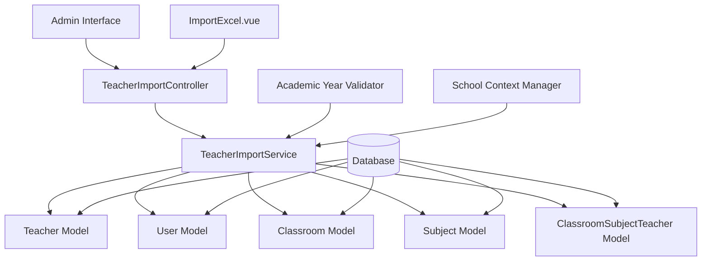
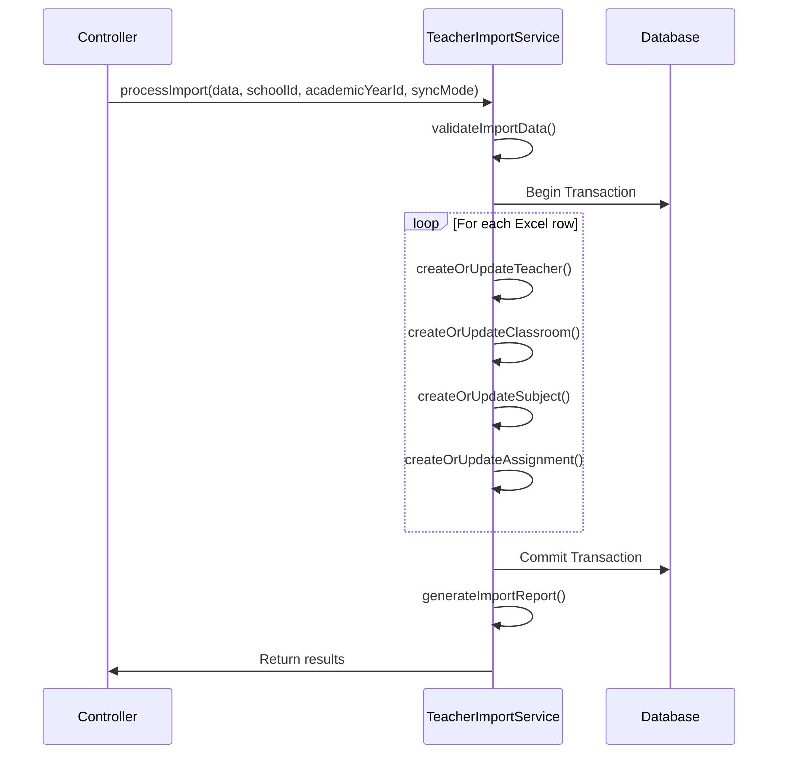

# Design Document

## Overview

The Teacher Excel Import System is a comprehensive solution for bulk importing teacher assignments from Excel files. It provides a web-based interface for administrators to upload Excel files containing teacher-classroom-subject assignments, automatically creates missing teachers and users, and manages the complex relationships between schools, academic years, classrooms, subjects, and teachers.

The system leverages the existing ImportExcel.vue component for file handling and preview functionality, while implementing new backend services for teacher-specific import logic. It maintains data integrity through database transactions and provides detailed feedback on import results.

## Architecture

### System Components



### Data Flow

1. **Pre-Import Validation**: Validate school and academic year selection
2. **File Upload**: Process Excel file using existing ImportExcel component
3. **Data Validation**: Validate Excel data structure and content
4. **Entity Creation**: Create missing teachers, users, classrooms, and subjects
5. **Assignment Management**: Create or update classroom-subject-teacher assignments
6. **Result Reporting**: Provide detailed import results and error reporting

## Components and Interfaces

### 1. TeacherImportController

**Purpose**: Handle HTTP requests for teacher import operations

**Key Methods**:
- `index()` - Display import page with school/academic year selection
- `validateImport(Request $request)` - Validate Excel data before import
- `processImport(Request $request)` - Execute the import process
- `getSchools()` - Get available schools for current user
- `getActiveAcademicYear($schoolId)` - Get active academic year for school

**Routes**:
- `GET /admin/teachers/import` - Import page
- `POST /admin/teachers/import/validate` - Validate import data
- `POST /admin/teachers/import/process` - Process import
- `GET /admin/teachers/import/schools` - Get schools
- `GET /admin/teachers/import/academic-year/{schoolId}` - Get academic year

### 2. TeacherImportService

**Purpose**: Core business logic for teacher import operations

**Key Methods**:
- `validateImportData(array $data, int $schoolId, int $academicYearId)` - Validate Excel data
- `processImport(array $data, int $schoolId, int $academicYearId, string $syncMode)` - Execute import
- `createOrUpdateTeacher(array $teacherData, int $schoolId)` - Handle teacher creation
- `createOrUpdateClassroom(string $name, int $schoolId)` - Handle classroom creation
- `createOrUpdateSubject(string $name, int $schoolId)` - Handle subject creation
- `createOrUpdateAssignment(array $assignmentData)` - Handle assignment creation
- `generateImportReport(array $results)` - Generate detailed import report

**Import Logic Flow**:


### 3. Enhanced Teacher Model

**Purpose**: Extend existing Teacher model with import-specific functionality

**New Methods**:
- `createWithUser(array $data, int $schoolId)` - Create teacher with associated user
- `syncUserStatus()` - Sync active status with user account
- `findByNameAndSchool(string $name, int $schoolId)` - Find existing teacher

**Boot Method Enhancement**:
```php
protected static function boot()
{
    parent::boot();
    
    static::creating(function ($teacher) {
        // Generate unique t_id
        if (empty($teacher->t_id)) {
            $teacher->t_id = self::generateUniqueTeacherId();
        }
        
        // Create or link user account
        $user = self::createOrFindUser($teacher);
        $teacher->user_id = $user->id;
    });
    
    static::updating(function ($teacher) {
        // Sync user active status
        if ($teacher->isDirty('active')) {
            $teacher->user->update(['active' => $teacher->active]);
        }
    });
    
    static::deleting(function ($teacher) {
        // Soft delete: deactivate user
        $teacher->user->update(['active' => false]);
    });
}
```

### 4. TeacherImport Vue Component

**Purpose**: Frontend interface for teacher import functionality

**Key Features**:
- School and academic year selection
- Excel file upload with preview
- Sync mode selection (Update Existing vs Full Sync)
- Import progress tracking
- Results display with error reporting

**Component Structure**:
```vue
<template>
  <div class="teacher-import-container">
    <!-- School & Academic Year Selection -->
    <div class="selection-panel">
      <SchoolSelector v-model="selectedSchool" />
      <AcademicYearDisplay :school-id="selectedSchool" />
    </div>
    
    <!-- Import Configuration -->
    <div class="import-config">
      <SyncModeSelector v-model="syncMode" />
    </div>
    
    <!-- Excel Import Component -->
    <ImportExcel
      :columns="teacherColumns"
      :validate-url="validateUrl"
      :import-url="importUrl"
      @imported="handleImportComplete"
    />
    
    <!-- Results Display -->
    <ImportResults v-if="showResults" :results="importResults" />
  </div>
</template>
```

## Data Models

### Excel File Structure

**Required Columns**:
- `Classroom` - Classroom name (string)
- `Subject` - Subject name (string)
- `Teacher Name` - Full teacher name (string)
- `Periods_per_Week` - Number of periods (integer)

**Optional Columns**:
- `Teacher Email` - Teacher email address
- `Phone` - Teacher phone number
- `National ID` - Teacher national identification
- `Gender` - Teacher gender (Male/Female)
- `Date of Birth` - Teacher birth date (YYYY-MM-DD)

### Database Schema Updates

**Teachers Table** (existing, no changes needed):
```sql
CREATE TABLE teachers (
    id BIGINT PRIMARY KEY,
    t_id VARCHAR(255) UNIQUE,
    school_id BIGINT,
    user_id BIGINT,
    name VARCHAR(255),
    email VARCHAR(255),
    phone_number VARCHAR(255),
    national_id VARCHAR(255),
    gender VARCHAR(255),
    date_of_birth DATE,
    active BOOLEAN DEFAULT 1,
    created_at TIMESTAMP,
    updated_at TIMESTAMP,
    deleted_at TIMESTAMP
);
```

**Classroom Subject Teachers Table** (existing, no changes needed):
```sql
CREATE TABLE classroom_subject_teachers (
    id BIGINT PRIMARY KEY,
    school_id BIGINT,
    academic_year_id BIGINT,
    classroom_id BIGINT,
    subject_id BIGINT,
    teacher_id BIGINT,
    classes_per_week INTEGER,
    created_at TIMESTAMP,
    updated_at TIMESTAMP,
    deleted_at TIMESTAMP,
    
    UNIQUE KEY unique_assignment (school_id, academic_year_id, classroom_id, subject_id, teacher_id)
);
```

## Correctness Properties

*A property is a characteristic or behavior that should hold true across all valid executions of a system-essentially, a formal statement about what the system should do. Properties serve as the bridge between human-readable specifications and machine-verifiable correctness guarantees.*

After analyzing the acceptance criteria, several properties can be combined for more comprehensive testing:

**Property Reflection:**
- Properties 2.2 and 2.4 both test column validation and can be combined into one comprehensive property
- Properties 3.1, 3.2, 3.3, 3.4, 3.5, and 3.7 all relate to teacher creation and can be combined into comprehensive teacher creation properties
- Properties 4.1, 4.2, and 4.3 can be combined into entity creation properties
- Properties 8.1 and 8.3 both test user-teacher status synchronization and can be combined

### Core Import Properties

**Property 1: School context persistence**
*For any* import session with selected school and academic year, all created entities and assignments should be associated with the correct school and academic year context throughout the entire process
**Validates: Requirements 1.2, 1.5, 5.4**

**Property 2: File format and structure validation**
*For any* uploaded file, the system should accept only .xlsx and .xls formats and require the presence of columns: Classroom, Subject, Teacher Name, Periods_per_Week
**Validates: Requirements 2.1, 2.2, 2.4**

**Property 3: Optional column handling**
*For any* Excel file, the system should process files correctly whether optional columns (Teacher Email, Phone, National ID, Gender, Date of Birth) are present or absent
**Validates: Requirements 2.3**

### Teacher Management Properties

**Property 4: Teacher creation with user account**
*For any* new teacher name not in the system, creating the teacher should result in: a unique t_id, a corresponding user record with role 'teacher', default password '12345678', and association with the selected school
**Validates: Requirements 3.1, 3.2, 3.3, 3.5, 3.7**

**Property 5: Teacher email defaulting**
*For any* teacher creation where no email is provided, the user email should be set to the teacher's t_id
**Validates: Requirements 3.4**

**Property 6: Existing teacher linking**
*For any* teacher name that already exists in the system, the import should link to the existing teacher record rather than creating a duplicate
**Validates: Requirements 3.6**

### Entity Creation Properties

**Property 7: Classroom and subject creation**
*For any* classroom or subject name not in the system, the system should create new records associated with the selected school
**Validates: Requirements 4.1, 4.2, 4.3**

**Property 8: Entity reuse**
*For any* classroom or subject that already exists for the school, the system should use the existing record rather than creating duplicates
**Validates: Requirements 4.4**

**Property 9: Name validation**
*For any* classroom or subject name that is empty or whitespace-only, the validation should fail
**Validates: Requirements 4.5**

### Assignment Management Properties

**Property 10: Update existing sync mode**
*For any* import with "Update Existing" mode, existing assignments should be updated and new assignments should be added without removing other assignments
**Validates: Requirements 5.2**

**Property 11: Full sync mode**
*For any* import with "Full Sync" mode, all existing assignments for the school and academic year should be replaced with the imported assignments
**Validates: Requirements 5.3**

**Property 12: Assignment updates**
*For any* assignment that already exists (same teacher-classroom-subject combination), the periods_per_week value should be updated to match the imported value
**Validates: Requirements 5.5**

**Property 13: Periods validation**
*For any* periods_per_week value, it must be a positive number for the assignment to be valid
**Validates: Requirements 5.6**

### Error Handling Properties

**Property 14: Partial failure processing**
*For any* import with both valid and invalid rows, the system should process all valid rows and collect all errors without stopping at the first error
**Validates: Requirements 6.5**

### Performance and Reliability Properties

**Property 15: Large file chunk processing**
*For any* Excel file larger than 1000 rows, the system should process it using chunk reading rather than loading everything into memory
**Validates: Requirements 7.1**

**Property 16: Transaction consistency**
*For any* import operation, either all changes should be committed successfully or all changes should be rolled back if any critical error occurs
**Validates: Requirements 7.3, 7.4**

**Property 17: File size limits**
*For any* uploaded file larger than 10MB, the system should reject the upload
**Validates: Requirements 7.5**

### Teacher Status Management Properties

**Property 18: Teacher-user status synchronization**
*For any* teacher status change (soft delete or active status update), the corresponding user account status should be synchronized accordingly
**Validates: Requirements 8.1, 8.3**

**Property 19: Historical data preservation**
*For any* teacher management operation (creation, update, deletion), all existing classroom_subject_teacher assignments should be preserved
**Validates: Requirements 8.2**

**Property 20: Inactive teacher assignment prevention**
*For any* teacher marked as inactive, the system should prevent new classroom assignments
**Validates: Requirements 8.4**

**Property 21: Referential integrity maintenance**
*For any* operation involving teachers, users, and assignments, all foreign key relationships should remain valid
**Validates: Requirements 8.5**

<function_calls>
<invoke name="prework">
<parameter name="featureName">teacher-excel-import

## Error Handling

### Validation Errors

**File Level Errors**:
- Invalid file format (not .xlsx or .xls)
- File size exceeds 10MB limit
- Missing required columns
- Empty file or no data rows

**Row Level Errors**:
- Empty required fields (Classroom, Subject, Teacher Name)
- Invalid periods_per_week (not a positive number)
- Invalid optional field formats (email, date of birth)

**System Level Errors**:
- No active academic year for selected school
- Database connection failures
- Transaction rollback scenarios

### Error Recovery

**Graceful Degradation**:
- Continue processing valid rows when individual rows fail
- Collect all errors for comprehensive reporting
- Maintain system stability during large imports

**Transaction Management**:
- Use database transactions for consistency
- Rollback all changes if critical system errors occur
- Preserve existing data integrity

**User Feedback**:
- Provide detailed error messages with row numbers
- Offer downloadable error reports
- Display progress indicators for long operations

## Testing Strategy

### Dual Testing Approach

The system will be validated using both unit tests and property-based tests to ensure comprehensive coverage:

**Unit Tests**: Focus on specific examples, edge cases, and integration points
- Test specific Excel file formats and structures
- Test error conditions and edge cases
- Test UI component interactions
- Test database transaction scenarios

**Property-Based Tests**: Verify universal properties across all inputs using PHPUnit with Eris library for property-based testing
- Generate random Excel data and verify import behavior
- Test with various school and academic year combinations
- Validate teacher creation across different input scenarios
- Verify assignment management with random data sets

### Property-Based Testing Configuration

- **Library**: PHPUnit with Eris for PHP property-based testing
- **Minimum Iterations**: 100 iterations per property test
- **Test Tagging**: Each property test must reference its design document property
- **Tag Format**: `@group Feature: teacher-excel-import, Property {number}: {property_text}`

### Test Categories

**Import Validation Tests**:
- File format validation across different file types
- Column structure validation with various combinations
- Data type validation for all fields

**Entity Management Tests**:
- Teacher creation and user account linking
- Classroom and subject creation with school association
- Assignment creation and updates

**Business Logic Tests**:
- Sync mode behavior (Update vs Full Sync)
- Status synchronization between teachers and users
- Historical data preservation

**Performance Tests**:
- Large file processing with chunk reading
- Memory usage during bulk imports
- Database transaction performance

**Error Handling Tests**:
- Partial failure scenarios
- Transaction rollback verification
- Error reporting accuracy

### Integration Testing

**End-to-End Scenarios**:
- Complete import workflow from file upload to results
- Multi-school import scenarios
- Academic year transition handling

**API Testing**:
- All controller endpoints with various input combinations
- Authentication and authorization verification
- Rate limiting and security measures

**Database Testing**:
- Data integrity verification
- Referential integrity maintenance
- Soft delete behavior validation