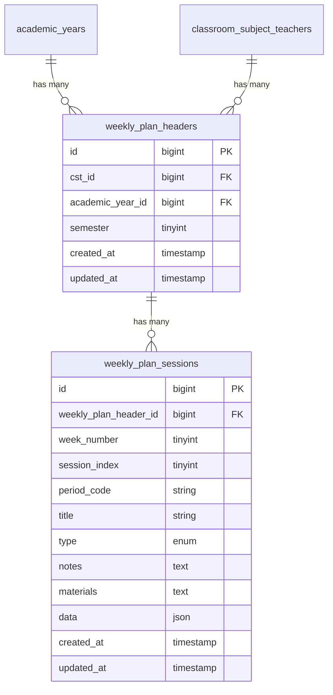

# Design Document

## Overview

The Weekly Plan System is designed as a modular Laravel application feature that provides teachers with flexible weekly planning capabilities. The system uses a two-table architecture with soft schedule linking to ensure stability when underlying schedules change. The design emphasizes modularity, extensibility, and seamless integration with existing classroom management structures.

## Architecture

### High-Level Architecture

The system follows a layered architecture pattern:

```
Frontend (Vue.js) → API Layer (Laravel Controllers) → Business Logic → Data Layer (Eloquent Models) → Database
```

### Key Architectural Decisions

1. **Soft Schedule Linking**: Uses `period_code` strings instead of foreign keys to maintain stability when schedules change
2. **Modular Organization**: All components organized under `/weeklyplansystem` namespace
3. **JSON Extensibility**: Uses JSON fields for custom data to avoid frequent schema changes
4. **RESTful API Design**: Follows REST principles for predictable API interactions

### Database Schema Design



## Components and Interfaces

### Backend Components

#### Models

**WeeklyPlanHeader Model**
- Manages the container for weekly plans
- Relationships: belongsTo classroom_subject_teachers, academic_years; hasMany weekly_plan_sessions
- Scopes: byTeacher, bySemester, byAcademicYear

**WeeklyPlanSession Model**
- Manages individual sessions within weekly plans
- Relationships: belongsTo weekly_plan_header
- Scopes: byWeek, byType, ordered
- Mutators: for JSON data field handling

#### Controllers

**WeeklyPlanHeaderController**
- `index()`: List weekly plan headers for authenticated teacher
- `show($id)`: Display specific weekly plan with sessions
- `store()`: Create new weekly plan header
- `update($id)`: Update weekly plan header details
- `destroy($id)`: Delete weekly plan header and sessions

**WeeklyPlanSessionController**
- `index()`: List sessions for a weekly plan header
- `show($id)`: Display specific session details
- `store()`: Create new session
- `update($id)`: Update session details
- `destroy($id)`: Delete session
- `reorder()`: Handle session reordering within weeks

#### Request Validation

**WeeklyPlanHeaderRequest**
- Validates cst_id exists in classroom_subject_teachers
- Validates academic_year_id exists
- Validates semester is 1 or 2
- Ensures teacher owns the cst_id

**WeeklyPlanSessionRequest**
- Validates weekly_plan_header_id ownership
- Validates week_number (1-18)
- Validates session_index is positive integer
- Validates type enum (lesson, quiz, exam, activity, break)
- Validates JSON data structure

### Frontend Components

#### Vue Pages

**WeeklyPlanOverview.vue**
- Displays teacher's assigned subjects and classes
- Shows weekly plan status for each assignment
- Provides navigation to specific weekly plans

**WeeklyPlanEditor.vue**
- Main editing interface for weekly plans
- Week navigation component
- Session grid display
- Drag-and-drop session reordering

#### Vue Components

**SessionCard.vue**
- Displays individual session information
- Inline editing capabilities
- Type-specific styling and icons
- Drag handle for reordering

**WeekNavigator.vue**
- Week selection interface (1-18)
- Progress indicators for completed weeks
- Quick navigation between weeks

**SessionModal.vue**
- Detailed session editing form
- JSON data field management
- Session type selection
- Material and note editing

### API Routes Design

```php
// Weekly Plan Headers
GET    /api/weeklyplansystem/headers          // List teacher's weekly plans
POST   /api/weeklyplansystem/headers          // Create new weekly plan
GET    /api/weeklyplansystem/headers/{id}     // Show specific weekly plan
PUT    /api/weeklyplansystem/headers/{id}     // Update weekly plan
DELETE /api/weeklyplansystem/headers/{id}     // Delete weekly plan

// Weekly Plan Sessions
GET    /api/weeklyplansystem/sessions         // List sessions (filtered by header_id)
POST   /api/weeklyplansystem/sessions         // Create new session
GET    /api/weeklyplansystem/sessions/{id}    // Show specific session
PUT    /api/weeklyplansystem/sessions/{id}    // Update session
DELETE /api/weeklyplansystem/sessions/{id}    // Delete session
POST   /api/weeklyplansystem/sessions/reorder // Reorder sessions
```

## Data Models

### WeeklyPlanHeader Model Structure

```php
class WeeklyPlanHeader extends Model
{
    protected $fillable = [
        'cst_id',
        'academic_year_id', 
        'semester'
    ];
    
    protected $casts = [
        'semester' => 'integer'
    ];
}
```

### WeeklyPlanSession Model Structure

```php
class WeeklyPlanSession extends Model
{
    protected $fillable = [
        'weekly_plan_header_id',
        'week_number',
        'session_index',
        'period_code',
        'title',
        'type',
        'notes',
        'materials',
        'data'
    ];
    
    protected $casts = [
        'week_number' => 'integer',
        'session_index' => 'integer',
        'data' => 'array'
    ];
}
```

### JSON Data Field Structure

```json
{
    "zoom_link": "https://zoom.us/j/123456789",
    "homework": "Complete exercises 1-5 on page 45",
    "skill_tags": ["algebra", "problem-solving", "critical-thinking"],
    "materials": ["textbook", "calculator", "worksheet"],
    "duration_minutes": 45,
    "difficulty_level": "intermediate"
}
```

## Error Handling

### API Error Responses

- **400 Bad Request**: Invalid input data or validation failures
- **401 Unauthorized**: User not authenticated
- **403 Forbidden**: User doesn't own the requested resource
- **404 Not Found**: Resource doesn't exist
- **422 Unprocessable Entity**: Validation errors with detailed field messages
- **500 Internal Server Error**: Unexpected server errors

### Frontend Error Handling

- Form validation with real-time feedback
- Toast notifications for API errors
- Graceful degradation when API is unavailable
- Retry mechanisms for failed requests
- Offline state detection and messaging

### Schedule Change Resilience

- Period code validation before session updates
- Batch update utility for schedule changes
- Conflict detection and resolution interface
- Backup and restore capabilities for critical changes

## Testing Strategy

### Backend Testing

**Unit Tests**
- Model relationships and scopes
- Validation rules in request classes
- Business logic in service classes
- Helper functions and utilities

**Feature Tests**
- API endpoint functionality
- Authentication and authorization
- CRUD operations with proper data
- Session reordering logic
- Schedule change handling

### Frontend Testing

**Component Tests**
- Vue component rendering
- User interaction handling
- Props and event emission
- Drag-and-drop functionality

**Integration Tests**
- API communication
- State management
- Route navigation
- Error handling flows

### Database Testing

- Migration rollback testing
- Foreign key constraint validation
- Data integrity checks
- Performance testing with large datasets

## Performance Considerations

### Database Optimization

- Proper indexing on foreign keys and frequently queried fields
- Composite indexes for week_number and session_index queries
- JSON field indexing for commonly accessed data attributes

### Caching Strategy

- Cache teacher's weekly plan headers
- Cache session data for current week
- Invalidate cache on updates
- Use Redis for session-based caching

### Frontend Optimization

- Lazy loading of weekly plan data
- Virtual scrolling for large session lists
- Debounced API calls for real-time editing
- Optimistic UI updates with rollback capability

## Security Considerations

### Authorization

- Teachers can only access their assigned weekly plans
- Admin users can access all weekly plans
- Resource ownership validation on all operations

### Data Validation

- Server-side validation for all inputs
- SQL injection prevention through Eloquent ORM
- XSS protection for user-generated content
- CSRF protection for state-changing operations

### API Security

- Rate limiting on API endpoints
- Request size limits for JSON data
- Input sanitization for text fields
- Secure handling of file uploads for materials