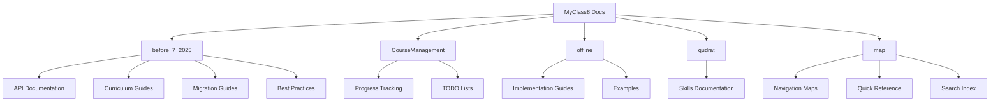

# MyClass8 Project Documentation Map

## Overview
This map provides a comprehensive guide to all documentation, components, and resources in the MyClass8 Laravel project.

## 📋 Quick Navigation

### 🏗️ Core Documentation
- [Project Overview](#project-overview)
- [Architecture Guide](#architecture-guide)
- [API Documentation](#api-documentation)
- [Database Schema](#database-schema)

### 📚 Feature Documentation
- [Course Management](#course-management)
- [User Management](#user-management)
- [Curriculum System](#curriculum-system)
- [Resume System](#resume-system)
- [Qudrat Quantitative](#qudrat-quantitative)

### 🔧 Development Resources
- [Setup Guides](#setup-guides)
- [Code Standards](#code-standards)
- [Migration Guides](#migration-guides)
- [Testing Documentation](#testing-documentation)

## 📁 Documentation Structure

## 🎯 Key Components

### Course Management System
- **Location**: `docs/CourseManagement/`
- **Status**: Active Development
- **Components**: Courses, Lessons, Levels, Sections, Teachers
- **Files**:
  - `done.md` - Completed features
  - `todo/1.md` - Priority tasks
  - `todo/2.md` - Secondary tasks

### Legacy Documentation
- **Location**: `docs/before_7_2025/`
- **Contains**: Historical documentation, migration guides, API references
- **Key Files**:
  - `documentation-portal.md` - Main documentation portal
  - `PROJECT_GUIDELINES_AND_BEST_PRACTICES.md` - Development standards
  - `api/` - API endpoint documentation
  - `curriculum/` - Curriculum system documentation

### Offline System
- **Location**: `docs/offline/`
- **Purpose**: Offline functionality documentation
- **Key Files**:
  - `README.md` - Overview and setup
  - `implementation.md` - Implementation details
  - `examples/` - Code examples

### Qudrat System
- **Location**: `docs/qudrat/`
- **Purpose**: Qudrat Quantitative assessment system
- **Key Files**:
  - `skills.md` - Skills and assessment documentation

## 📋 Complete Map Index

### 🗺️ Navigation Maps
- **[Course Management Map](./course-management.md)** - Complete course system documentation
- **[Legacy Documentation Map](./legacy-documentation.md)** - Historical documentation and migration guides
- **[Offline System Map](./offline-system.md)** - Offline functionality and PWA features
- **[Qudrat System Map](./qudrat-system.md)** - Assessment and skills documentation
- **[Directory Structure Map](./directory-structure.md)** - Visual project structure guide
- **[Quick Reference Guide](./quick-reference.md)** - Development commands and troubleshooting
- **[Search Index](./search-index.md)** - Comprehensive documentation search and keywords

### 🎯 Quick Access
| Need | Go To |
|------|-------|
| **Start Development** | [Quick Reference Guide](./quick-reference.md) |
| **Understand Course System** | [Course Management Map](./course-management.md) |
| **Find Legacy Docs** | [Legacy Documentation Map](./legacy-documentation.md) |
| **Setup Offline Features** | [Offline System Map](./offline-system.md) |
| **Search Any Topic** | [Search Index](./search-index.md) |
| **View Project Structure** | [Directory Structure Map](./directory-structure.md) |

## 🔗 Quick Links

### Development Entry Points
- [Main Documentation Portal](../before_7_2025/documentation-portal.md)
- [Project Guidelines](../before_7_2025/PROJECT_GUIDELINES_AND_BEST_PRACTICES.md)
- [Course Management TODO](../CourseManagement/todo/1.md)

### API References
- [User Context API](../before_7_2025/api/user-context-endpoints.md)
- [Curriculum API](../before_7_2025/curriculum/api-endpoints.md)

### Migration Guides
- [User Context Migration](../before_7_2025/migration/user-context-migration.md)
- [Database Schema](../before_7_2025/curriculum/database-schema.md)

## 📊 Project Statistics

| Section | Files | Last Updated | Status |
|---------|--------|--------------|---------|
| CourseManagement | 3 | July 2025 | 🟢 Active |
| before_7_2025 | 12+ | July 2025 | 🟡 Legacy |
| offline | 6+ | July 2025 | 🟢 Active |
| qudrat | 1 | July 2025 | 🟢 Active |
| map | 8 | July 2025 | 🟢 Active |

## 🚀 Getting Started

1. **New Developers**: Start with [Project Guidelines](../before_7_2025/PROJECT_GUIDELINES_AND_BEST_PRACTICES.md)
2. **API Development**: Check [API Documentation](../before_7_2025/api/)
3. **Course Features**: Review [Course Management](../CourseManagement/)
4. **Offline Features**: See [Offline Documentation](../offline/)

## 🔄 Cross-References
All maps are interconnected with bidirectional links:
- Each map links back to this main index
- Related topics are cross-referenced between maps
- Quick navigation paths are provided for common tasks
- Emergency troubleshooting guides are linked from multiple locations

## 🔄 Maintenance

This map is automatically updated when new documentation is added. For suggestions or missing documentation, please create an issue or update the relevant section.

---
*Last Updated: July 17, 2025*