# MyClass8 Project - Complete System Understanding

## 🎯 Project Overview
MyClass8 is a comprehensive Laravel-based educational platform designed for managing courses, assessments, resumes, and offline learning capabilities. The system follows modern architectural patterns with clear separation of concerns and extensive documentation.

## 🏗️ System Architecture

### High-Level Architecture

```mermaid
graph TD
    A[MyClass8 Platform] --> B[Course Management System]
    A --> C[Resume Management System]
    A --> D[Qudrat Quantitative System]
    A --> E[Offline System]
    A --> F[Documentation Portal]
    A --> G[User Management]
    
    B --> B1[Course → Level → Section → Lesson]
    B --> B2[Teacher Assignment]
    B --> B3[Import/Export]
    B --> B4[Progress Tracking]
    
    C --> C1[Resume Questions Manager]
    C --> C2[QBank2 - Interactive Q&A]
    C --> C3[Voice & AI Integration]
    C --> C4[Assessment Tools]
    
    D --> D1[Skills Assessment]
    D --> D2[Quantitative Testing]
    D --> D3[Performance Analytics]
    
    E --> E1[PWA Features]
    E --> E2[Service Worker]
    E --> E3[IndexedDB Storage]
    E --> E4[Background Sync]
    
    F --> F1[File-based Docs]
    F --> F2[Database Docs]
    F --> F3[Role-based Access]
    F --> F4[Search & Filtering]
    
    G --> G1[Authentication]
    G --> G2[Authorization]
    G --> G3[User Profiles]
    G --> G4[Role Management]
```


## 📊 Core Systems Deep Dive

### 1. Course Management System ✅ COMPLETE
**Status**: Fully implemented and operational

**Architecture**:
- **Hierarchical Structure**: Course → CourseLevel → CourseSection → CourseLesson
- **Database Schema**: 4 main tables with soft deletes and user tracking
- **API**: 31 RESTful routes with nested resource structure
- **Frontend**: Vue 3 + Inertia.js with comprehensive CRUD operations

**Key Components**:
- **Models**: `Course`, `CourseLevel`, `CourseSection`, `CourseLesson`
- **Controllers**: Full CRUD with reorder functionality
- **Features**: Teacher assignment, Excel import/export, progress tracking

**File Structure**:
```
app/Models/CourseManagement/
├── Course.php
├── CourseLevel.php
├── CourseSection.php
└── CourseLesson.php

app/Http/Controllers/CourseManagement/
├── CourseController.php
├── CourseLevelController.php
├── CourseSectionController.php
├── CourseLessonController.php
├── TeacherAssignmentController.php
└── CourseImportController.php
```

### 2. Resume Management System ✅ ENHANCED
**Status**: Advanced implementation with AI integration

**Architecture**:
- **System**: Resume Questions Manager (QBank2)
- **Technology**: Vue 3 + Quasar with advanced interactive features
- **Database**: Enhanced schema with interaction tracking

**Key Features**:
- **Question Management**: Browse, create, edit questions with categories
- **Answer System**: Rich text, file attachments, status management
- **Interactive Elements**: Ratings, likes, comments, bookmarks
- **Voice Integration**: Recording, playback, metadata storage
- **AI Features**: Gemini-powered prompt generation, text-to-speech

**Technical Implementation**:
```javascript
// Core Components
ResumeQuestionsManager.vue      // Main component (21KB, 771 lines)
QuestionDetailsDialog.vue       // Full-screen details (8.2KB, 316 lines)
AnswerCard.vue                  // Individual answers (17KB, 610 lines)
VoiceRecorderDialog.vue         // Voice recording (14KB, 571 lines)
GeminiPrompt.vue                // AI integration (15KB, 567 lines)
```

**Database Schema**:
- **Core Tables**: `resume_questions`, `resume_answers`
- **Interaction Tables**: `resume_answer_ratings`, `resume_answer_likes`, `resume_comment_likes`
- **Enhanced Fields**: Voice notes, AI metadata, interaction counts

### 3. Qudrat Quantitative System 📋 ACTIVE
**Status**: Active development
**Purpose**: Skills assessment and quantitative testing
**Location**: `docs/quadrat/` and `app/Controllers/QudratQuantitative/`

### 4. Offline System 🔄 PROGRESSIVE
**Status**: Basic implementation complete, advanced features in progress

**Technology Stack**:
- **PWA**: Service Worker with Workbox
- **Storage**: IndexedDB with Dexie.js
- **Sync**: Background sync API
- **Strategy**: Cache-first with network fallback

**Features**:
- Offline course access
- Background data synchronization
- Cross-device state management
- Progressive enhancement

### 5. Documentation Portal 📚 HYBRID
**Status**: Fully operational with role-based access

**Architecture**:
- **Type**: Hybrid file-based + database documentation
- **Access Control**: Admin/Developer only
- **Discovery**: Automatic markdown file scanning

**Features**:
- Auto-discovery of documentation files
- Beautiful Quasar-based UI
- Advanced search and filtering
- Category-based navigation
- Print and export functionality
- Dark mode support

## 🔗 Integration Architecture

### Authentication & Authorization


### Data Flow Patterns


### Shared Components
- **UI Framework**: Vue 3 + Quasar + Tailwind CSS
- **State Management**: Pinia stores + Composables
- **HTTP Client**: Axios with interceptors
- **Validation**: Laravel Request classes + Vue validation
- **Error Handling**: Centralized error boundaries
- **Loading States**: Consistent loading indicators

## 🛠️ Technical Stack

### Backend Technologies
- **Framework**: Laravel 12 (latest)
- **Database**: MySQL 8.0 with JSON support
- **Authentication**: Laravel Sanctum
- **Queue System**: Redis for background jobs
- **File Storage**: Local + Cloud (configurable)
- **API**: RESTful with resource controllers
- **Testing**: PHPUnit + Laravel Dusk

### Frontend Technologies
- **Framework**: Vue 3 with Composition API
- **UI Library**: Quasar Framework
- **Styling**: Tailwind CSS + Quasar variables
- **State Management**: Pinia stores
- **Routing**: Vue Router with Inertia.js
- **Build Tool**: Vite with hot module replacement
- **Type Safety**: Prop validation + TypeScript-ready

### Progressive Web App
- **Service Worker**: Workbox-based
- **Storage**: IndexedDB with Dexie.js wrapper
- **Manifest**: PWA configuration
- **Strategies**: Cache-first, network-first, stale-while-revalidate
- **Sync**: Background sync API

## 📁 Directory Structure

### Key Directories
```
myclass8/
├── app/
│   ├── Http/Controllers/
│   │   ├── CourseManagement/
│   │   ├── QudratQuantitative/
│   │   └── Api/
│   ├── Models/
│   │   ├── CourseManagement/
│   │   └── Resume/
│   └── Actions/
├── resources/
│   ├── js/
│   │   ├── Pages/
│   │   │   ├── CourseManagement/
│   │   │   └── modules/resumes/
│   │   └── Components/
├── docs/
│   ├── map/              # Navigation maps
│   ├── CourseManagement/ # Progress tracking
│   ├── before_7_2025/  # Legacy docs
│   └── offline/         # Offline system docs
├── database/
│   ├── migrations/
│   └── seeders/
└── routes/
    ├── web.php
    ├── api.php
    └── course_management.php
```

## 🔐 Security Architecture

### Authentication Flow
1. **Web Login**: Session-based authentication
2. **API Access**: Token-based with CSRF protection
3. **Role Checking**: Middleware-based authorization
4. **Permission System**: Laravel Spatie roles and permissions

### Security Measures
- **Input Validation**: Comprehensive request validation
- **XSS Prevention**: Vue auto-escaping + DOMPurify
- **SQL Injection**: Eloquent ORM with prepared statements
- **CSRF Protection**: Laravel tokens + Axios integration
- **File Upload**: Validation + sanitization
- **Rate Limiting**: API throttling

## 🚀 Deployment Architecture

### Production Setup
```bash
# Laravel optimization
php artisan config:cache
php artisan route:cache
php artisan view:cache
php artisan optimize

# Frontend build
npm run build

# Database
php artisan migrate --force
```

### Environment Configuration
- **Development**: Hot module replacement, detailed error pages
- **Staging**: