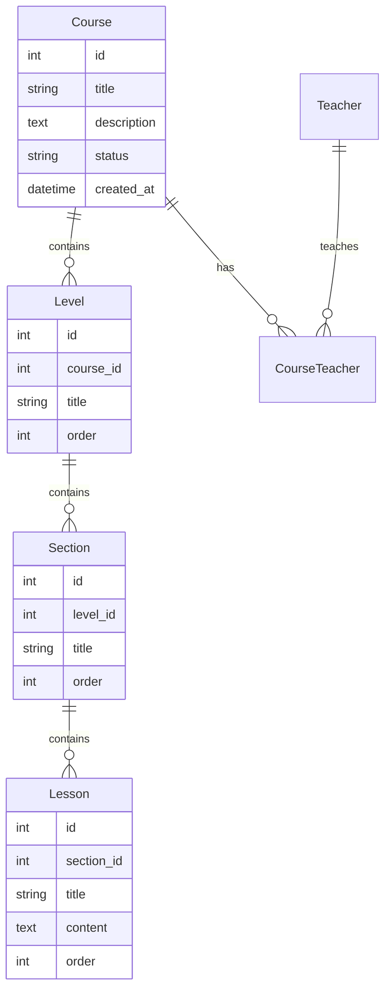
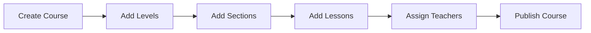

# Course Management System Map

## Overview
Complete documentation and progress tracking for the Course Management system in MyClass8.

## 📊 Current Status

### ✅ Completed Features ([done.md](../CourseManagement/done.md))
- Basic course structure implementation
- Course creation and editing
- Level management system
- Lesson organization
- Teacher assignment functionality

### 📋 Active Tasks ([todo/1.md](../CourseManagement/todo/1.md))
- Course import functionality
- Excel import/export features
- Advanced filtering and search
- Bulk operations

### 🔮 Future Tasks ([todo/2.md](../CourseManagement/todo/2.md))
- Advanced analytics
- Student progress tracking
- Assessment integration
- Certificate generation

## 🏗️ Architecture

### Database Schema

### Key Components

#### Backend Controllers
- [`CourseImportController.php`](../../app/Http/Controllers/CourseManagement/CourseImportController.php) - Handles Excel imports
- [`CourseLevelController.php`](../../app/Http/Controllers/CourseManagement/CourseLevelController.php) - Manages course levels

#### Frontend Pages
- [`Course/Index.vue`](../../resources/js/Pages/CourseManagement/Course/Index.vue) - Course listing
- [`Course/Create.vue`](../../resources/js/Pages/CourseManagement/Course/Create.vue) - Course creation
- [`Course/components/CourseCard.vue`](../../resources/js/Pages/CourseManagement/Course/components/CourseCard.vue) - Course display component
- [`Level/Create.vue`](../../resources/js/Pages/CourseManagement/Level/Create.vue) - Level creation
- [`Level/Show.vue`](../../resources/js/Pages/CourseManagement/Level/Show.vue) - Level details
- [`Lesson/Create.vue`](../../resources/js/Pages/CourseManagement/Lesson/Create.vue) - Lesson creation
- [`Lesson/Edit.vue`](../../resources/js/Pages/CourseManagement/Lesson/Edit.vue) - Lesson editing
- [`Lesson/Show.vue`](../../resources/js/Pages/CourseManagement/Lesson/Show.vue) - Lesson details

#### Shared Components
- [`ImportExcel.vue`](../../resources/js/Components/Common/ImportExcel.vue) - Excel import component

#### Routes
- [`course_management.php`](../../routes/course_management.php) - All course management routes

#### Database
- [`2025_07_17_000001_create_course_teacher_table.php`](../../database/migrations/2025_07_17_000001_create_course_teacher_table.php) - Teacher relationship migration
- [`CourseManagementSeeder.php`](../../database/seeders/CourseManagementSeeder.php) - Test data seeder

## 🔄 Workflows

### Course Creation Flow

### Import Process

## 📋 Development Checklist

### Current Sprint
- [ ] Complete Excel import functionality
- [ ] Add bulk course operations
- [ ] Implement advanced search
- [ ] Add course templates

### Next Sprint
- [ ] Student enrollment system
- [ ] Progress tracking
- [ ] Assessment integration
- [ ] Certificate generation

## 🔗 Related Documentation
- [Main Project Map](./README.md)
- [Legacy Documentation](../before_7_2025/documentation-portal.md)
- [API Endpoints](../before_7_2025/api/user-context-endpoints.md)

## 🚨 Important Notes
- All course data is scoped by academic year
- Teacher assignments require proper authorization
- Excel imports support bulk operations
- Course hierarchy: Course → Level → Section → Lesson

---
*Last Updated: July 17, 2025*