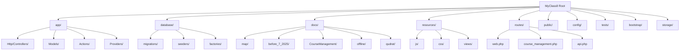
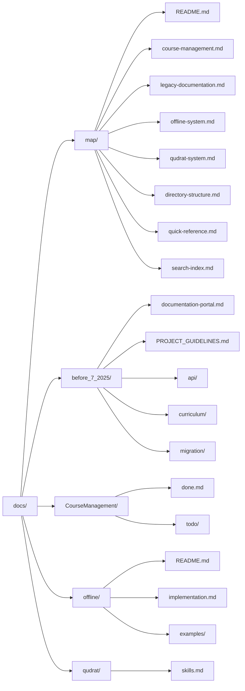
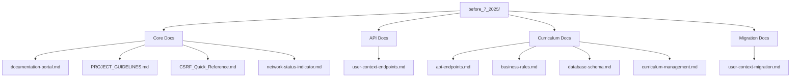
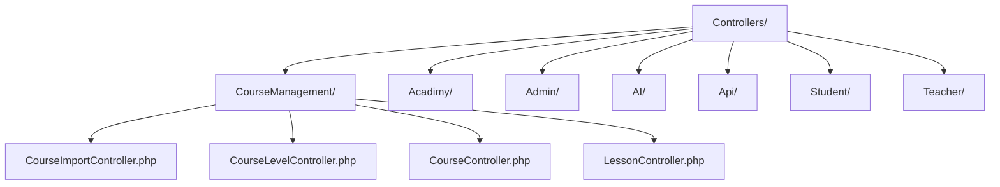
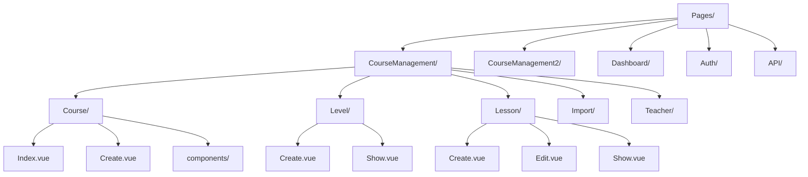
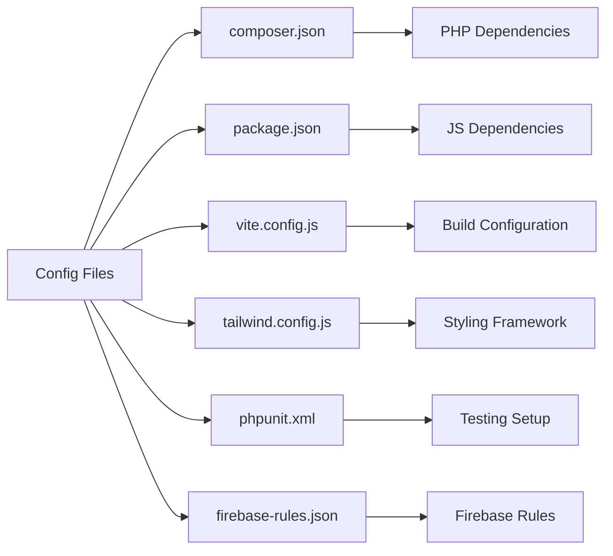

# MyClass8 Directory Structure Map

## Overview
Complete visual representation of the MyClass8 project directory structure, focusing on documentation and key components.

## 📁 Project Root Structure

## 📚 Documentation Directory Deep Dive

### docs/ - Main Documentation

### before_7_2025/ - Legacy Documentation

## 🏗️ Key Application Directories

### app/Http/Controllers/

### resources/js/Pages/

## 📊 File Statistics

### Documentation Files
| Directory | Files | Purpose | Status |
|-----------|--------|---------|---------|
| `docs/map/` | 8 | Project navigation maps | 🟢 Active |
| `docs/before_7_2025/` | 12+ | Legacy documentation | 🟡 Historical |
| `docs/CourseManagement/` | 3 | Progress tracking | 🟢 Active |
| `docs/offline/` | 6+ | Offline system docs | 🟢 Active |
| `docs/qudrat/` | 1 | Assessment system | 🟢 Active |

### Key Configuration Files

## 🔍 Quick Navigation Paths

### Development Entry Points
1. **Start Here**: `docs/map/README.md`
2. **Course Features**: `docs/map/course-management.md`
3. **Legacy Context**: `docs/map/legacy-documentation.md`
4. **Offline Features**: `docs/map/offline-system.md`
5. **Assessment System**: `docs/map/qudrat-system.md`

### Code Navigation
1. **Controllers**: `app/Http/Controllers/CourseManagement/`
2. **Models**: `app/Models/CourseManagement/`
3. **Views**: `resources/js/Pages/CourseManagement/`
4. **Routes**: `routes/course_management.php`
5. **Migrations**: `database/migrations/`

### Configuration Files
- **Environment**: `.env`
- **Database**: `config/database.php`
- **Cache**: `config/cache.php`
- **Queue**: `config/queue.php`
- **Services**: `config/services.php`

## 🚨 Important Notes

### Directory Conventions
- **PascalCase**: Used for Vue components
- **kebab-case**: Used for file names
- **camelCase**: Used for JavaScript variables
- **snake_case**: Used for PHP variables and database columns

### File Organization
- **Controllers**: Grouped by feature domain
- **Models**: Organized by system modules
- **Views**: Mirror the route structure
- **Assets**: Compiled through Vite

### Documentation Maintenance
- **Active docs**: Update with each feature
- **Legacy docs**: Preserve for reference
- **Map files**: Auto-generated and maintained
- **Examples**: Kept in sync with current implementation

## 🔗 Related Maps
- [Main Project Map](./README.md)
- [Course Management Map](./course-management.md)
- [Legacy Documentation](./legacy-documentation.md)
- [Offline System Map](./offline-system.md)
- [Qudrat System Map](./qudrat-system.md)

---
*Last Updated: July 17, 2025*