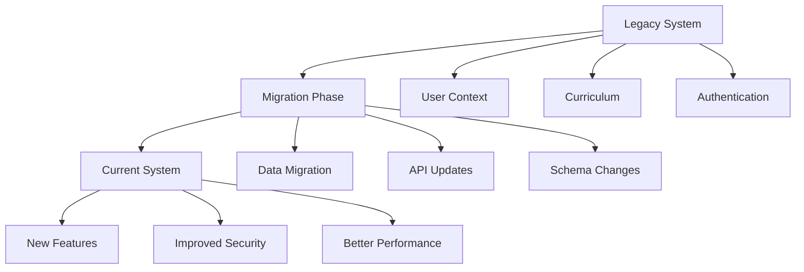

# Legacy Documentation Map (before_7_2025)

## Overview
Historical documentation and guides from the initial project phases. These documents provide foundational knowledge and migration context.

## 📁 File Structure

### Core Documentation
- **[documentation-portal.md](../before_7_2025/documentation-portal.md)** - Main documentation portal
- **[PROJECT_GUIDELINES_AND_BEST_PRACTICES.md](../before_7_2025/PROJECT_GUIDELINES_AND_BEST_PRACTICES.md)** - Development standards and practices
- **[CSRF_Quick_Reference.md](../before_7_2025/CSRF_Quick_Reference.md)** - CSRF protection guide
- **[CSRF_Token_Fix_Documentation.md](../before_7_2025/CSRF_Token_Fix_Documentation.md)** - CSRF implementation fixes
- **[network-status-indicator.md](../before_7_2025/network-status-indicator.md)** - Network monitoring documentation
- **[RESUME_QBANK2_REFERENCE.md](../before_7_2025/RESUME_QBANK2_REFERENCE.md)** - Resume question bank documentation
- **[users-management.md](../before_7_2025/users-management.md)** - User management system guide

### API Documentation
**Location**: `api/`
- **[user-context-endpoints.md](../before_7_2025/api/user-context-endpoints.md)** - User context API endpoints

### Composables Documentation
**Location**: `composables/`
- **[useUserContext.md](../before_7_2025/composables/useUserContext.md)** - User context composable guide

### Curriculum Documentation
**Location**: `curriculum/`
- **[api-endpoints.md](../before_7_2025/curriculum/api-endpoints.md)** - Curriculum API endpoints
- **[business-rules.md](../before_7_2025/curriculum/business-rules.md)** - Curriculum business logic
- **[curriculum-management.md](../before_7_2025/curriculum/curriculum-management.md)** - Curriculum management guide
- **[database-schema.md](../before_7_2025/curriculum/database-schema.md)** - Curriculum database structure

### Migration Documentation
**Location**: `migration/`
- **[user-context-migration.md](../before_7_2025/migration/user-context-migration.md)** - User context system migration

## 🎯 Key Topics Covered

### Security
- CSRF token implementation and fixes
- User authentication and authorization
- Security best practices

### User Management
- User context system
- Role-based access control
- User profile management

### Curriculum System
- Course structure design
- Business rules implementation
- Database schema design
- API endpoint specifications

### Development Practices
- Code standards and guidelines
- Project structure conventions
- Testing approaches
- Documentation standards

## 🔗 Migration Context

### From Legacy to Current

### Important Notes
- **Status**: Legacy documentation - still relevant for context
- **Compatibility**: Some APIs may have evolved
- **Reference Value**: High for understanding system evolution
- **Maintenance**: Read-only, preserved for historical context

## 📋 Quick Reference

### Most Referenced Documents
1. **[PROJECT_GUIDELINES_AND_BEST_PRACTICES.md](../before_7_2025/PROJECT_GUIDELINES_AND_BEST_PRACTICES.md)** - Essential reading for new developers
2. **[documentation-portal.md](../before_7_2025/documentation-portal.md)** - Starting point for all documentation
3. **[curriculum/database-schema.md](../before_7_2025/curriculum/database-schema.md)** - Database structure reference

### API Documentation Priority
1. **[user-context-endpoints.md](../before_7_2025/api/user-context-endpoints.md)**
2. **[curriculum/api-endpoints.md](../before_7_2025/curriculum/api-endpoints.md)**

### Migration Guides
1. **[user-context-migration.md](../before_7_2025/migration/user-context-migration.md)**

## 🚨 Usage Guidelines

### For New Developers
1. Start with [PROJECT_GUIDELINES_AND_BEST_PRACTICES.md](../before_7_2025/PROJECT_GUIDELINES_AND_BEST_PRACTICES.md)
2. Review [documentation-portal.md](../before_7_2025/documentation-portal.md) for overview
3. Check relevant API documentation for your feature area

### For Migration Tasks
1. Reference [user-context-migration.md](../before_7_2025/migration/user-context-migration.md)
2. Compare with current implementation
3. Update documentation as needed

### For Debugging
1. Check [CSRF_Token_Fix_Documentation.md](../before_7_2025/CSRF_Token_Fix_Documentation.md) for security issues
2. Review [network-status-indicator.md](../before_7_2025/network-status-indicator.md) for connectivity issues

## 🔗 Related Maps
- [Main Project Map](./README.md)
- [Course Management Map](./course-management.md)
- [Offline System Map](./offline-system.md)

---
*Status: Legacy/Historical | Last Updated: July 17, 2025*