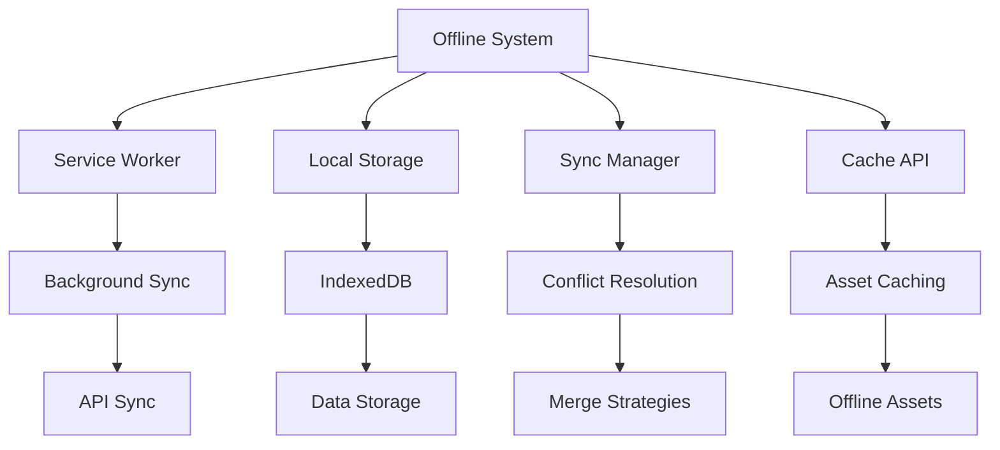
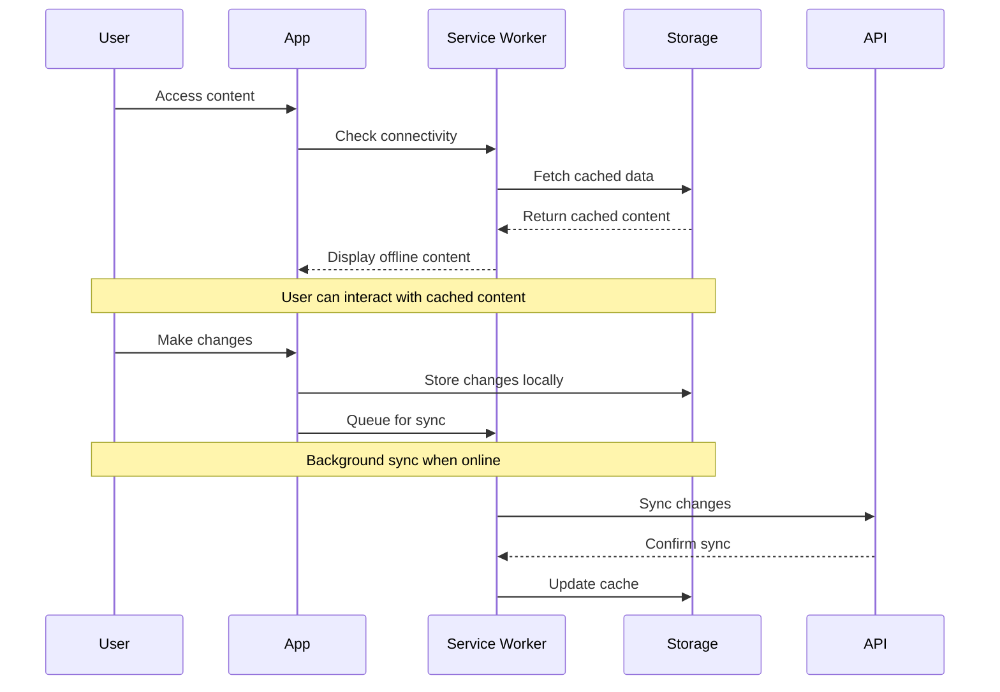

# Offline System Documentation Map

## Overview
Complete documentation for the offline functionality system in MyClass8, enabling users to work without internet connectivity.

## 📁 Documentation Structure

### Core Files
- **[README.md](../offline/README.md)** - System overview and setup guide
- **[implementation.md](../offline/implementation.md)** - Technical implementation details
- **[basic-usage.md](../offline/basic-usage.md)** - User guide for offline features
- **[concepts.md](../offline/concepts.md)** - Core concepts and architecture
- **[IMPLEMENTATION_COMPLETE.md](../offline/IMPLEMENTATION_COMPLETE.md)** - Completion status

### Examples
**Location**: `examples/`
- **[LessonManager.vue](../offline/examples/LessonManager.vue)** - Example offline lesson management component

## 🏗️ Architecture

### Offline System Components


### Key Features
1. **Service Worker Integration**
   - Background sync for API calls
   - Asset caching for offline access
   - Push notification support

2. **Local Data Storage**
   - IndexedDB for structured data
   - LocalStorage for settings
   - Cache API for assets

3. **Sync Management**
   - Conflict resolution strategies
   - Data merging algorithms
   - Offline queue management

## 📋 Implementation Status

### ✅ Completed ([IMPLEMENTATION_COMPLETE.md](../offline/IMPLEMENTATION_COMPLETE.md))
- Service worker registration
- Basic caching strategies
- Offline data storage
- Background sync setup

### 🔄 In Progress
- Advanced conflict resolution
- Real-time sync optimization
- Performance improvements

### 📅 Planned
- Progressive web app features
- Advanced caching strategies
- Cross-device synchronization

## 🎯 Usage Patterns

### Basic Offline Flow


### Data Synchronization
- **Automatic**: Background sync when connection restored
- **Manual**: User-triggered sync option
- **Conflict Resolution**: Last-write-wins with user override option

## 🔧 Technical Details

### Service Worker Configuration
- **Scope**: `/` (root)
- **Cache Names**: 
  - `static-v1` - Static assets
  - `dynamic-v1` - API responses
  - `offline-v1` - Offline fallback

### Storage Structure
```javascript
// IndexedDB Schema
{
  courses: [],
  lessons: [],
  userProgress: {},
  settings: {},
  syncQueue: []
}
```

### API Endpoints
- `GET /api/sync/status` - Check sync status
- `POST /api/sync/push` - Push local changes
- `GET /api/sync/pull` - Pull remote changes
- `POST /api/sync/resolve` - Resolve conflicts

## 📱 Progressive Web App Features

### Manifest Configuration
- **Name**: MyClass8 Offline
- **Short Name**: MyClass8
- **Display**: Standalone
- **Orientation**: Portrait
- **Theme Color**: #3B82F6

### Icon Requirements
- 192x192px for home screen
- 512x512px for splash screen
- SVG for scalability

## 🚨 Important Considerations

### Data Limits
- **IndexedDB**: ~6% of available storage
- **LocalStorage**: 5-10MB per origin
- **Cache API**: Varies by browser

### Performance Tips
1. **Cache First**: Serve from cache, update in background
2. **Stale While Revalidate**: Immediate response with background update
3. **Network Timeout**: Fallback to cache after timeout

### Browser Support
- **Chrome**: Full support
- **Firefox**: Full support
- **Safari**: Partial support (no background sync)
- **Edge**: Full support

## 🔗 Related Documentation
- [Main Project Map](./README.md)
- [Legacy Documentation](./legacy-documentation.md)
- [Course Management Map](./course-management.md)

## 📋 Development Checklist

### Setup
- [ ] Service worker registration
- [ ] Cache configuration
- [ ] IndexedDB schema setup
- [ ] Sync manager initialization

### Testing
- [ ] Offline functionality tests
- [ ] Sync conflict resolution tests
- [ ] Performance benchmarks
- [ ] Cross-browser compatibility

### Deployment
- [ ] HTTPS configuration (required for PWA)
- [ ] Manifest validation
- [ ] Service worker scope verification
- [ ] Cache invalidation strategy

---
*Status: Active Development | Last Updated: July 17, 2025*