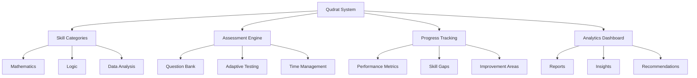
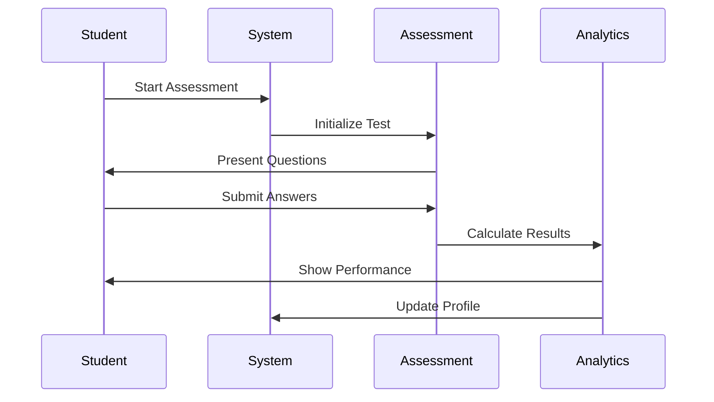
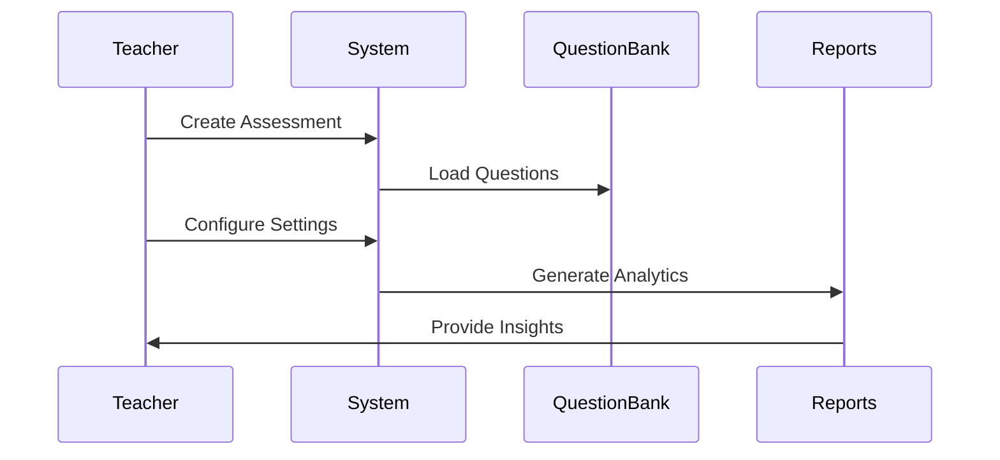
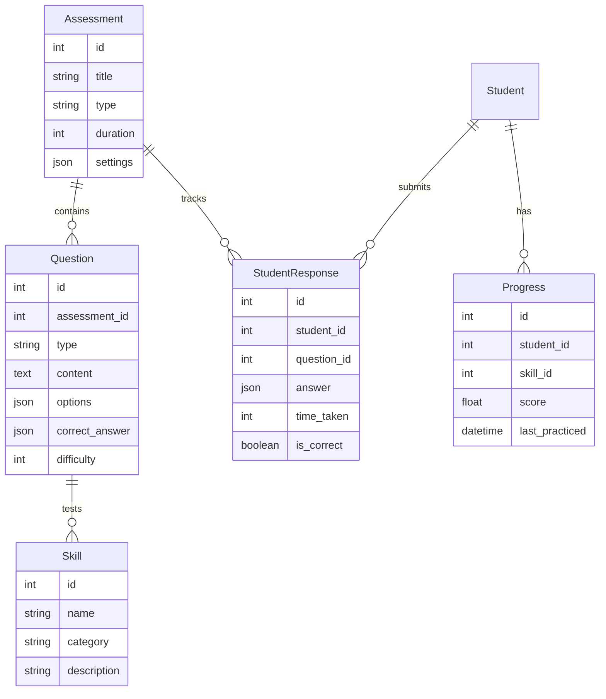

# Qudrat Quantitative System Map

## Overview
Documentation for the Qudrat Quantitative assessment system, designed for standardized testing and skill evaluation.

## 📁 Documentation Structure

### Core Files
- **[skills.md](../qudrat/skills.md)** - Comprehensive skills documentation and assessment criteria

## 🎯 System Purpose

### What is Qudrat?
Qudrat Quantitative is a specialized assessment system for:
- **Mathematical Skills Evaluation**
- **Quantitative Reasoning**
- **Problem-Solving Assessment**
- **Standardized Testing**

### Target Audience
- **Students**: Preparing for standardized tests
- **Teachers**: Creating and managing assessments
- **Institutions**: Conducting large-scale evaluations
- **Parents**: Tracking student progress

## 🏗️ System Architecture

### Assessment Structure

### Skill Categories ([skills.md](../qudrat/skills.md))
1. **Mathematical Skills**
   - Arithmetic operations
   - Algebra fundamentals
   - Geometry concepts
   - Statistics basics

2. **Logical Reasoning**
   - Pattern recognition
   - Sequence analysis
   - Critical thinking
   - Problem decomposition

3. **Data Analysis**
   - Chart interpretation
   - Statistical reasoning
   - Data sufficiency
   - Trend analysis

## 📊 Assessment Features

### Question Types
- **Multiple Choice**: Single correct answer
- **Multiple Select**: Multiple correct answers
- **Numeric Entry**: Direct input
- **Drag & Drop**: Interactive ordering
- **Hotspot**: Visual interaction

### Difficulty Levels
- **Foundation**: Basic concepts
- **Intermediate**: Applied knowledge
- **Advanced**: Complex problem-solving
- **Expert**: Critical thinking

### Adaptive Testing
- **Dynamic Difficulty**: Adjusts based on performance
- **Personalized Path**: Tailored to skill level
- **Real-time Feedback**: Immediate insights
- **Progress Tracking**: Continuous monitoring

## 🔄 Workflows

### Student Journey

### Teacher Workflow

## 🛠️ Technical Implementation

### Database Schema

### Key Components

#### Backend
- **Assessment Controller**: Manages test sessions
- **Question Bank Service**: Handles question retrieval
- **Analytics Engine**: Calculates performance metrics
- **Progress Tracker**: Monitors student advancement

#### Frontend
- **Assessment Interface**: Question presentation
- **Progress Dashboard**: Performance visualization
- **Skill Tree**: Learning path display
- **Analytics Widget**: Real-time insights

## 📈 Analytics & Reporting

### Performance Metrics
- **Accuracy Rate**: Percentage of correct answers
- **Response Time**: Average time per question
- **Skill Mastery**: Proficiency level per skill
- **Progress Rate**: Improvement over time

### Reports Available
1. **Individual Reports**
   - Skill-wise performance
   - Time analysis
   - Improvement trends
   - Weak areas identification

2. **Class Reports**
   - Class average performance
   - Comparative analysis
   - Top performers
   - Areas needing attention

3. **Institutional Reports**
   - Overall statistics
   - Teacher performance
   - Curriculum effectiveness
   - Resource allocation

## 🎯 Use Cases

### Student Practice
- **Daily Practice**: Regular skill reinforcement
- **Mock Tests**: Full-length assessments
- **Targeted Practice**: Focus on weak areas
- **Progress Tracking**: Monitor improvement

### Teacher Tools
- **Assessment Creation**: Custom test building
- **Class Management**: Student grouping
- **Performance Monitoring**: Real-time tracking
- **Parent Communication**: Progress sharing

### Institutional Features
- **Bulk Assessments**: Large-scale testing
- **Standardized Testing**: Consistent evaluation
- **Analytics Dashboard**: Institutional insights
- **Integration APIs**: Third-party connections

## 🔗 Related Documentation
- [Main Project Map](./README.md)
- [Course Management Map](./course-management.md)
- [Legacy Documentation](./legacy-documentation.md)

## 📋 Development Roadmap

### Phase 1: Core Features ✅
- [x] Basic assessment engine
- [x] Question bank management
- [x] Student progress tracking
- [x] Basic analytics

### Phase 2: Advanced Features 🔄
- [ ] Adaptive testing algorithm
- [ ] Advanced analytics
- [ ] Mobile app integration
- [ ] AI-powered recommendations

### Phase 3: Enterprise Features 📅
- [ ] Multi-institutional support
- [ ] Advanced reporting
- [ ] Integration APIs
- [ ] White-label solutions

---
*Status: Active Development | Last Updated: July 17, 2025*