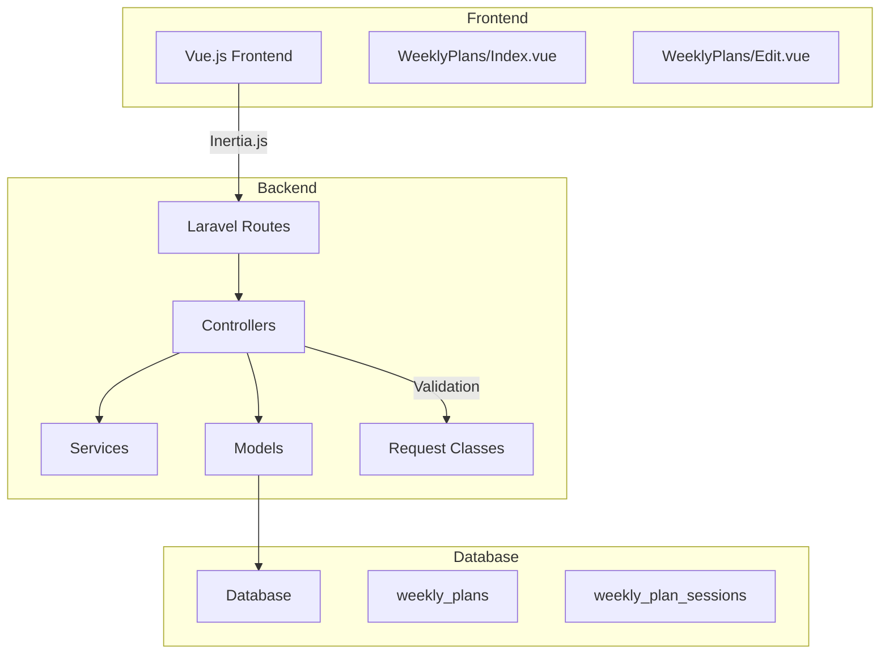
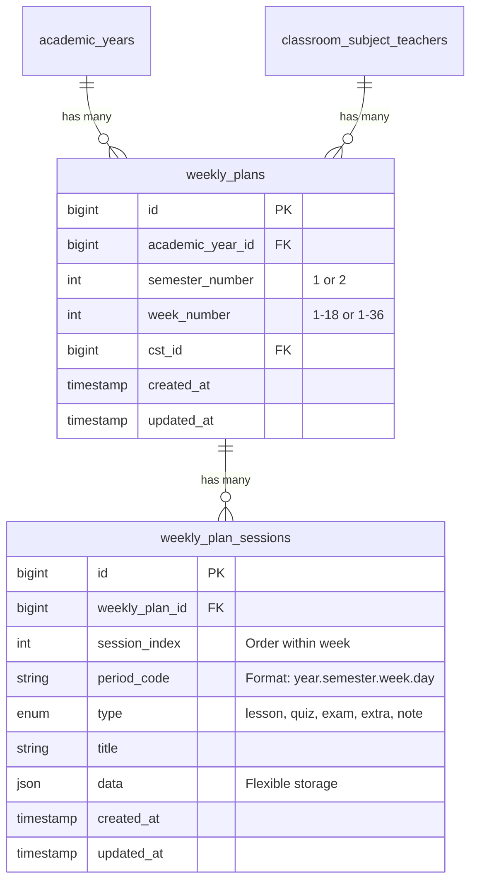
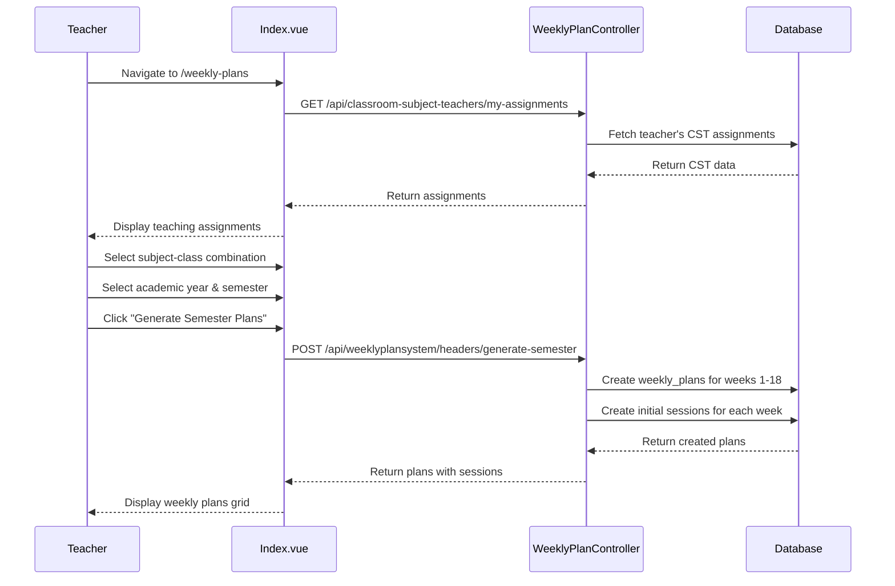
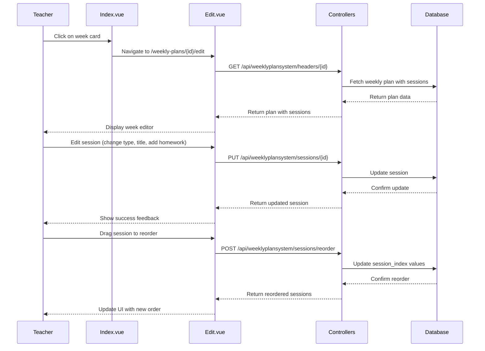
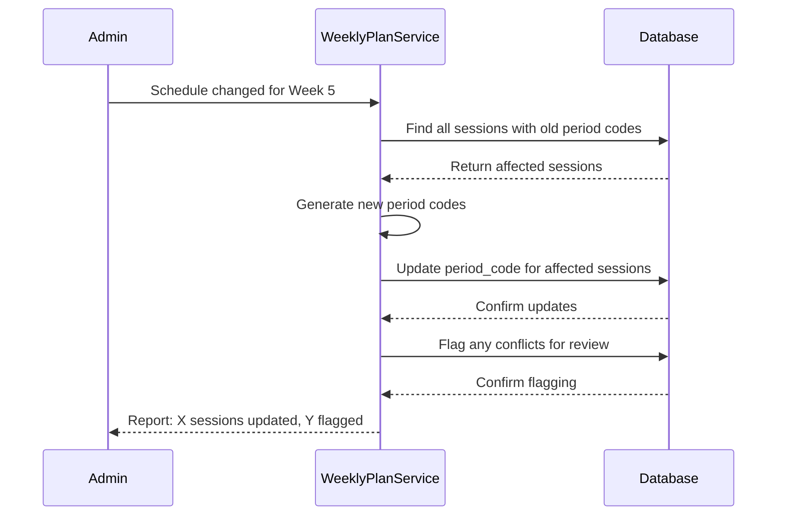

# Weekly Plans System - Comprehensive Documentation

## Table of Contents

1. [System Overview](#system-overview)
2. [Architecture](#architecture)
3. [Database Schema](#database-schema)
4. [Backend Implementation](#backend-implementation)
5. [Frontend Implementation](#frontend-implementation)
6. [API Endpoints](#api-endpoints)
7. [Features & Functionality](#features--functionality)
8. [User Workflows](#user-workflows)
9. [Implementation Status](#implementation-status)

---

## System Overview

### Purpose

The **Weekly Plans System** is a modular Laravel-based feature that enables teachers to create, manage, and customize weekly session plans for their assigned subjects and classes. The system provides flexibility to edit, reorder, and customize sessions while maintaining stability even when the underlying fixed schedule changes.

### Key Characteristics

-   **Modular Design**: All code organized under `/weeklyplansystem` namespace
-   **Schedule Independence**: Uses soft references (`period_code`) instead of hard foreign keys
-   **Flexibility**: Fully editable weekly plans that persist regardless of schedule changes
-   **Teacher-Centric**: Each teacher manages their own weekly plans for their assigned classes
-   **Semester-Based**: Supports planning for 1-36 weeks per semester

### Technology Stack

-   **Backend**: Laravel (PHP)
-   **Frontend**: Vue.js 3 with Inertia.js
-   **UI Framework**: Quasar
-   **Database**: MySQL/MariaDB
-   **Authentication**: Laravel Sanctum

---

## Architecture

### High-Level Architecture



### Layered Architecture Pattern

```
Frontend (Vue.js)
    ↓
API Layer (Laravel Controllers)
    ↓
Business Logic (Services)
    ↓
Data Layer (Eloquent Models)
    ↓
Database
```

### Key Architectural Decisions

1. **Soft Schedule Linking**: Uses `period_code` strings instead of foreign keys to maintain stability when schedules change
2. **Modular Organization**: All components organized under `/weeklyplansystem` namespace
3. **JSON Extensibility**: Uses JSON fields for custom data to avoid frequent schema changes
4. **RESTful API Design**: Follows REST principles for predictable API interactions
5. **Teacher Authorization**: All operations require teacher ownership validation

---

## Database Schema

### Entity Relationship Diagram



### Table: `weekly_plans`

**Purpose**: Container for weekly plans, one per subject/class/week combination

| Column             | Type      | Description                                 |
| ------------------ | --------- | ------------------------------------------- |
| `id`               | bigint    | Primary key                                 |
| `academic_year_id` | bigint    | Foreign key to `academic_years`             |
| `semester_number`  | integer   | Semester (1 or 2)                           |
| `week_number`      | integer   | Week number (1-18 or 1-36)                  |
| `cst_id`           | bigint    | Foreign key to `classroom_subject_teachers` |
| `created_at`       | timestamp | Creation timestamp                          |
| `updated_at`       | timestamp | Last update timestamp                       |

**Indexes**:

-   Unique composite index: `(academic_year_id, semester_number, week_number, cst_id)`

**Migration**: [2025_07_18_135500_create_weekly_plans_table.php](file:///D:/my_projects/2025/myclass9/myclass9/database/migrations/2025_07_18_135500_create_weekly_plans_table.php)

### Table: `weekly_plan_sessions`

**Purpose**: Individual editable sessions within a weekly plan

| Column           | Type      | Description                                             |
| ---------------- | --------- | ------------------------------------------------------- |
| `id`             | bigint    | Primary key                                             |
| `weekly_plan_id` | bigint    | Foreign key to `weekly_plans` (cascade delete)          |
| `session_index`  | integer   | Order within week (1, 2, 3...)                          |
| `period_code`    | string    | Soft reference: `year.semester.week.day`                |
| `type`           | enum      | Session type: `lesson`, `quiz`, `exam`, `extra`, `note` |
| `title`          | string    | Session title                                           |
| `data`           | json      | Flexible storage for materials, links, homework, tags   |
| `created_at`     | timestamp | Creation timestamp                                      |
| `updated_at`     | timestamp | Last update timestamp                                   |

**Indexes**:

-   Composite: `(weekly_plan_id, session_index)`
-   Single: `period_code`
-   Single: `type`

**Migration**: [2025_07_18_135501_create_weekly_plan_sessions_table.php](file:///D:/my_projects/2025/myclass9/myclass9/database/migrations/2025_07_18_135501_create_weekly_plan_sessions_table.php)

### Period Code Format

The `period_code` is a string-based soft reference with format: `academic_year.semester.week.day`

**Example**: `25.1.2.5`

-   `25` = Academic year 2025
-   `1` = First semester
-   `2` = Week 2
-   `5` = Day 5 (Friday)

**Benefits**:

-   No hard foreign key dependency on schedule tables
-   Weekly plans remain intact when schedules change
-   Easy to update if schedule mapping changes
-   Maintains historical data integrity

### JSON Data Field Structure

The `data` field in `weekly_plan_sessions` supports flexible content:

```json
{
    "zoom_link": "https://zoom.us/j/123456789",
    "homework": "Complete exercises 1-5 on page 45",
    "skill_tags": ["algebra", "problem-solving", "critical-thinking"],
    "materials": ["textbook", "calculator", "worksheet"],
    "duration_minutes": 45,
    "difficulty_level": "intermediate",
    "completed": false
}
```

---

## Backend Implementation

### Models

#### WeeklyPlan Model

**Location**: [app/Models/WeeklyPlan.php](file:///D:/my_projects/2025/myclass9/myclass9/app/Models/WeeklyPlan.php)

**Fillable Attributes**:

-   `academic_year_id`
-   `semester_number`
-   `week_number`
-   `cst_id`

**Relationships**:

-   `academicYear()` - belongsTo `AcademicYear`
-   `classroomSubjectTeacher()` - belongsTo `ClassroomSubjectTeacher`
-   `sessions()` - hasMany `WeeklyPlanSession` (ordered by `session_index`)

**Casts**:

-   `semester_number` → integer
-   `week_number` → integer

#### WeeklyPlanSession Model

**Location**: [app/Models/WeeklyPlanSession.php](file:///D:/my_projects/2025/myclass9/myclass9/app/Models/WeeklyPlanSession.php)

**Fillable Attributes**:

-   `weekly_plan_id`
-   `session_index`
-   `period_code`
-   `type`
-   `title`
-   `data`

**Relationships**:

-   `weeklyPlan()` - belongsTo `WeeklyPlan`

**Casts**:

-   `session_index` → integer
-   `type` → string
-   `data` → array

**Helper Methods**:

-   `getPeriodCodeComponents()` - Parse period code into components
-   `isType(string $type)` - Check if session matches a specific type
-   `getDataValue(string $key, $default = null)` - Get value from JSON data
-   `setDataValue(string $key, $value)` - Set value in JSON data

### Controllers

#### WeeklyPlanController

**Location**: [app/Http/Controllers/WeeklyPlanController.php](file:///D:/my_projects/2025/myclass9/myclass9/app/Http/Controllers/WeeklyPlanController.php)

**Key Methods**:

| Method                    | Purpose                                    | Authorization            |
| ------------------------- | ------------------------------------------ | ------------------------ |
| `index()`                 | List teacher's weekly plans with filters   | Teacher ownership        |
| `store()`                 | Create new weekly plan                     | Teacher ownership of CST |
| `show()`                  | Display specific weekly plan with sessions | Teacher ownership        |
| `update()`                | Update weekly plan details                 | Teacher ownership        |
| `destroy()`               | Delete weekly plan and sessions            | Teacher ownership        |
| `generateSemesterPlans()` | Generate plans for all weeks in semester   | Teacher ownership        |
| `getByAcademicYear()`     | Get plans by academic year                 | Teacher ownership        |
| `getBySemester()`         | Get plans by semester                      | Teacher ownership        |
| `getByWeek()`             | Get plans by specific week                 | Teacher ownership        |
| `getByCst()`              | Get plans by CST assignment                | Teacher ownership        |

**Authorization Pattern**:

```php
$teacherId = $this->getTeacherId();
if ($weeklyPlan->classroomSubjectTeacher->teacher_id !== $teacherId) {
    return response()->json(['message' => 'Unauthorized'], 403);
}
```

#### WeeklyPlanSessionController

**Location**: [app/Http/Controllers/WeeklyPlanSessionController.php](file:///D:/my_projects/2025/myclass9/myclass9/app/Http/Controllers/WeeklyPlanSessionController.php)

**Key Methods**:

-   `index()` - List sessions for a weekly plan
-   `store()` - Create new session
-   `show()` - Display specific session
-   `update()` - Update session details
-   `destroy()` - Delete session
-   `reorder()` - Reorder sessions within a week
-   `bulkUpdate()` - Update multiple sessions at once

### Request Validation

#### WeeklyPlanRequest

**Location**: [app/Http/Requests/WeeklyPlanRequest.php](file:///D:/my_projects/2025/myclass9/myclass9/app/Http/Requests/WeeklyPlanRequest.php)

**Validation Rules**:

-   `cst_id` - Required, must exist in `classroom_subject_teachers`
-   `academic_year_id` - Required, must exist in `academic_years`
-   `semester_number` - Required, must be 1 or 2
-   `week_number` - Required, integer between 1-36
-   Teacher must own the CST assignment

#### WeeklyPlanSessionRequest

**Location**: [app/Http/Requests/WeeklyPlanSessionRequest.php](file:///D:/my_projects/2025/myclass9/myclass9/app/Http/Requests/WeeklyPlanSessionRequest.php)

**Validation Rules**:

-   `weekly_plan_id` - Required, must exist and be owned by teacher
-   `session_index` - Required, positive integer
-   `period_code` - Required, string format
-   `type` - Required, enum: `lesson`, `quiz`, `exam`, `extra`, `note`
-   `title` - Required, string
-   `data` - Optional, valid JSON structure

### Services

#### WeeklyPlanService

**Location**: [app/Services/WeeklyPlanService.php](file:///D:/my_projects/2025/myclass9/myclass9/app/Services/WeeklyPlanService.php)

**Key Responsibilities**:

-   Generate semester plans for all weeks
-   Create initial sessions based on `classes_per_week`
-   Generate period codes
-   Handle session reordering logic
-   Manage schedule change updates
-   Provide utility functions for plan management

---

## Frontend Implementation

### Pages

#### WeeklyPlans/Index.vue

**Location**: [resources/js/Pages/WeeklyPlans/Index.vue](file:///D:/my_projects/2025/myclass9/myclass9/resources/js/Pages/WeeklyPlans/Index.vue)

**Purpose**: Main overview page for teachers to view and manage their weekly plans

**Key Features**:

-   Display teacher's assigned subject-class combinations (CST)
-   Academic year and semester selection
-   Generate semester plans button
-   Weekly plans grid with status indicators
-   Progress tracking for each week
-   Navigation to weekly plan editor

**UI Sections**:

1. **Teaching Assignments Grid**: Shows all CST assignments with class name, subject, and sessions per week
2. **Academic Year & Semester Selection**: Dropdowns to filter plans
3. **Weekly Plans Grid**: Cards for each week showing:
    - Week number
    - Status badge (Empty, Planned, In Progress, Complete)
    - Number of sessions planned
    - Progress bar and percentage
4. **Empty State**: Prompts to generate semester plans
5. **Loading State**: Spinner during data fetching

**Key Functions**:

-   `loadInitialData()` - Load academic years and teacher assignments
-   `selectCst(cst)` - Select a classroom-subject-teacher assignment
-   `loadWeeklyPlans()` - Load weekly plans for selected CST
-   `generateSemesterPlans()` - Generate plans for entire semester
-   `openWeeklyPlan(plan)` - Navigate to weekly plan editor
-   `getWeekStatus(plan)` - Calculate week status based on sessions
-   `getWeekProgress(plan)` - Calculate completion percentage

#### WeeklyPlans/Edit.vue

**Location**: Referenced in routes, implementation pending

**Purpose**: Detailed editor for individual weekly plans

**Expected Features** (based on design docs):

-   Week navigator component
-   Session cards with drag-and-drop
-   Session modal for detailed editing
-   Add/remove session functionality
-   Session type selection
-   Real-time validation

### Components

Based on the design documentation, the following components are planned:

#### SessionCard.vue

-   Display individual session information
-   Inline editing capabilities
-   Type-specific styling and icons
-   Drag handle for reordering

#### WeekNavigator.vue

-   Week selection interface (1-18)
-   Progress indicators for completed weeks
-   Quick navigation between weeks

#### SessionModal.vue

-   Detailed session editing form
-   JSON data field management
-   Session type selection
-   Material and note editing

---

## API Endpoints

### Weekly Plan Headers

**Base Path**: `/api/weeklyplansystem/headers`

| Method | Endpoint                     | Purpose                     | Parameters                                                     |
| ------ | ---------------------------- | --------------------------- | -------------------------------------------------------------- |
| GET    | `/headers`                   | List teacher's weekly plans | `cst_id`, `academic_year_id`, `semester_number`                |
| POST   | `/headers`                   | Create new weekly plan      | `cst_id`, `academic_year_id`, `semester_number`, `week_number` |
| GET    | `/headers/{id}`              | Show specific weekly plan   | -                                                              |
| PUT    | `/headers/{id}`              | Update weekly plan          | `cst_id`, `academic_year_id`, `semester_number`, `week_number` |
| DELETE | `/headers/{id}`              | Delete weekly plan          | -                                                              |
| POST   | `/headers/generate-semester` | Generate semester plans     | `cst_id`, `academic_year_id`, `semester_number`, `total_weeks` |

### Weekly Plan Sessions

**Base Path**: `/api/weeklyplansystem/sessions`

| Method | Endpoint                | Purpose                  | Parameters                                                                |
| ------ | ----------------------- | ------------------------ | ------------------------------------------------------------------------- |
| GET    | `/sessions`             | List sessions            | `weekly_plan_id`                                                          |
| POST   | `/sessions`             | Create new session       | `weekly_plan_id`, `session_index`, `period_code`, `type`, `title`, `data` |
| GET    | `/sessions/{id}`        | Show specific session    | -                                                                         |
| PUT    | `/sessions/{id}`        | Update session           | `session_index`, `period_code`, `type`, `title`, `data`                   |
| DELETE | `/sessions/{id}`        | Delete session           | -                                                                         |
| POST   | `/sessions/reorder`     | Reorder sessions         | `sessions[]` with `id` and `session_index`                                |
| POST   | `/sessions/bulk-update` | Update multiple sessions | `sessions[]` with updates                                                 |

### Legacy API Routes (Backward Compatibility)

**Base Path**: `/api`

| Method | Endpoint                                                         | Purpose                    |
| ------ | ---------------------------------------------------------------- | -------------------------- |
| GET    | `/weekly-plans/by-academic-year/{academicYearId}`                | Get plans by academic year |
| GET    | `/weekly-plans/by-semester/{academicYearId}/{semester}`          | Get plans by semester      |
| GET    | `/weekly-plans/by-week/{academicYearId}/{semester}/{weekNumber}` | Get plans by week          |
| GET    | `/weekly-plans/by-cst/{cstId}`                                   | Get plans by CST           |

### Authentication & Authorization

All API endpoints require:

-   **Authentication**: Laravel Sanctum middleware (`auth`, `verified`)
-   **Authorization**: Teacher must own the CST assignment for the weekly plan
-   **Rate Limiting**: Applied to prevent abuse

### Error Responses

| Status Code | Meaning               | Example                          |
| ----------- | --------------------- | -------------------------------- |
| 200         | Success               | Plan retrieved successfully      |
| 201         | Created               | New plan created                 |
| 204         | No Content            | Plan deleted successfully        |
| 400         | Bad Request           | Invalid input data               |
| 401         | Unauthorized          | User not authenticated           |
| 403         | Forbidden             | Teacher doesn't own the resource |
| 404         | Not Found             | Resource doesn't exist           |
| 422         | Unprocessable Entity  | Validation errors                |
| 500         | Internal Server Error | Unexpected error                 |

---

## Features & Functionality

### Core Features

#### 1. Weekly Plan Management

-   **Create Plans**: Generate weekly plans for specific CST assignments
-   **View Plans**: Display all weekly plans with filtering by academic year, semester, CST
-   **Edit Plans**: Modify weekly plan details
-   **Delete Plans**: Remove weekly plans and associated sessions
-   **Semester Generation**: Auto-generate plans for all weeks in a semester (1-18 or 1-36 weeks)

#### 2. Session Management

-   **Add Sessions**: Create new sessions within a weekly plan
-   **Edit Sessions**: Modify session details (title, type, period code, data)
-   **Delete Sessions**: Remove sessions from weekly plans
-   **Reorder Sessions**: Drag-and-drop reordering within a week
-   **Bulk Update**: Update multiple sessions simultaneously
-   **Session Types**: Support for lesson, quiz, exam, extra, and note sessions

#### 3. Schedule Independence

-   **Soft Linking**: Uses `period_code` strings instead of foreign keys
-   **Schedule Resilience**: Plans remain intact when fixed schedules change
-   **Period Code Updates**: Utility to update period codes without losing session data
-   **Conflict Detection**: Flag sessions with invalid period codes for manual review

#### 4. Teacher Authorization

-   **Ownership Validation**: Teachers can only access their own weekly plans
-   **CST-Based Access**: Access controlled through classroom-subject-teacher assignments
-   **Secure Operations**: All CRUD operations validate teacher ownership

#### 5. Flexible Data Storage

-   **JSON Data Field**: Store custom data (zoom links, homework, skill tags, materials)
-   **Extensible Structure**: Add new data fields without schema changes
-   **Type-Specific Data**: Different data structures for different session types

#### 6. Progress Tracking

-   **Week Status**: Empty, Planned, In Progress, Complete
-   **Completion Percentage**: Track session completion within each week
-   **Visual Indicators**: Progress bars and status badges

### Advanced Features

#### 7. Semester Planning

-   **Bulk Generation**: Create plans for entire semester (18-36 weeks)
-   **Auto-Population**: Generate initial sessions based on `classes_per_week`
-   **Customization**: Edit generated plans individually

#### 8. Session Customization

-   **Flexible Titles**: Custom titles for each session
-   **Rich Data**: Store materials, homework, zoom links, skill tags
-   **Type Variations**: Different session types for different activities

#### 9. Schedule Change Handling

-   **Period Code Validation**: Detect invalid period codes
-   **Batch Updates**: Update period codes across multiple sessions
-   **Data Preservation**: Maintain all custom data during schedule changes

---

## User Workflows

### Workflow 1: Creating Weekly Plans for a Semester



**Steps**:

1. Teacher navigates to `/weekly-plans`
2. System displays teacher's assigned subject-class combinations
3. Teacher selects a CST assignment
4. Teacher selects academic year and semester
5. Teacher clicks "Generate Semester Plans"
6. System creates weekly plans for all weeks (1-18 or 1-36)
7. System generates initial sessions based on `classes_per_week`
8. Teacher sees grid of weekly plans with status indicators

### Workflow 2: Editing a Weekly Plan



**Steps**:

1. Teacher clicks on a week card from the weekly plans grid
2. System navigates to weekly plan editor (`/weekly-plans/{id}/edit`)
3. System loads weekly plan with all sessions
4. Teacher can:
    - Edit session details (title, type, notes, materials)
    - Add custom data (zoom link, homework, skill tags)
    - Reorder sessions via drag-and-drop
    - Add new sessions
    - Remove sessions
    - Change session types
5. System validates and saves changes
6. Teacher sees updated weekly plan

### Workflow 3: Handling Schedule Changes



**Steps**:

1. Fixed schedule changes (e.g., day 5 moved to day 3)
2. Admin runs schedule change utility
3. System identifies affected sessions by period code
4. System updates period codes to new schedule
5. System preserves all session data (title, type, custom data)
6. System flags any conflicts for manual review
7. Teachers' weekly plans remain intact with updated period codes

### Workflow 4: Viewing Progress

**Steps**:

1. Teacher navigates to weekly plans overview
2. System displays all weeks with status indicators:
    - **Empty**: No sessions planned
    - **Planned**: Sessions created but not started
    - **In Progress**: Some sessions completed
    - **Complete**: All sessions completed
3. Progress bars show completion percentage
4. Teacher can filter by academic year, semester, or CST
5. Teacher can click on any week to view/edit details

---

## Implementation Status

### Completed Tasks ✅

#### Phase 1: Database Foundation (Complete)

-   ✅ Created migration for `weekly_plans` table
-   ✅ Created migration for `weekly_plan_sessions` table
-   ✅ Implemented `WeeklyPlan` model with relationships
-   ✅ Implemented `WeeklyPlanSession` model with helper methods
-   ✅ Set up proper foreign keys and indexes

#### Phase 2: Backend API (Complete)

-   ✅ Created `WeeklyPlanController` with CRUD operations
-   ✅ Created `WeeklyPlanSessionController` with session management
-   ✅ Implemented `WeeklyPlanRequest` validation
-   ✅ Implemented `WeeklyPlanSessionRequest` validation
-   ✅ Created `WeeklyPlanService` for business logic
-   ✅ Added teacher authorization to all operations

#### Phase 3: API Routes (Complete)

-   ✅ Defined RESTful routes under `/api/weeklyplansystem`
-   ✅ Applied authentication middleware
-   ✅ Added legacy routes for backward compatibility
-   ✅ Organized routes in dedicated `routes/weekly_plans.php` file

#### Phase 4: Business Logic (Complete)

-   ✅ Semester plan generation functionality
-   ✅ Session reordering logic
-   ✅ Bulk update functionality
-   ✅ Period code generation utilities
-   ✅ Schedule change resilience features

#### Phase 5: Frontend - Overview Page (Complete)

-   ✅ Created `WeeklyPlans/Index.vue` overview page
-   ✅ Teaching assignments display
-   ✅ Academic year & semester selection
-   ✅ Weekly plans grid with status indicators
-   ✅ Progress tracking and visualization
-   ✅ Generate semester plans functionality
-   ✅ Navigation to weekly plan editor

#### Phase 6: Error Handling (Complete)

-   ✅ API error responses with proper HTTP codes
-   ✅ Frontend error handling
-   ✅ Form validation with real-time feedback
-   ✅ Authorization error handling

### Pending Tasks 📋

#### Phase 7: Frontend - Editor Page (Pending)

-   ⏳ Create `WeeklyPlans/Edit.vue` editor page
-   ⏳ Implement `SessionCard.vue` component
-   ⏳ Build `WeekNavigator.vue` component
-   ⏳ Create `SessionModal.vue` for detailed editing
-   ⏳ Add drag-and-drop functionality
-   ⏳ Implement session addition/removal UI

#### Phase 8: Testing (Pending)

-   ⏳ Unit tests for models and relationships
-   ⏳ Feature tests for API endpoints
-   ⏳ Component tests for Vue components
-   ⏳ Integration tests for API communication
-   ⏳ Database migration tests

#### Phase 9: Performance Optimization (Pending)

-   ⏳ Database indexing optimization
-   ⏳ Caching strategy implementation
-   ⏳ Frontend lazy loading
-   ⏳ Virtual scrolling for large lists
-   ⏳ Debounced API calls

#### Phase 10: Final Integration (Pending)

-   ⏳ Integration with existing lesson system
-   ⏳ Real-time updates implementation
-   ⏳ Export functionality
-   ⏳ Documentation completion

### Implementation Progress

| Component                | Status          | Completion |
| ------------------------ | --------------- | ---------- |
| Database Schema          | ✅ Complete     | 100%       |
| Models                   | ✅ Complete     | 100%       |
| Controllers              | ✅ Complete     | 100%       |
| Request Validation       | ✅ Complete     | 100%       |
| Services                 | ✅ Complete     | 100%       |
| API Routes               | ✅ Complete     | 100%       |
| Authorization            | ✅ Complete     | 100%       |
| Frontend - Overview      | ✅ Complete     | 100%       |
| Frontend - Editor        | ⏳ Pending      | 0%         |
| Frontend Components      | ⏳ Pending      | 0%         |
| Testing                  | ⏳ Pending      | 0%         |
| Performance Optimization | ⏳ Pending      | 0%         |
| **Overall Progress**     | **In Progress** | **~65%**   |

---

## File Structure

### Backend Files

```
app/
├── Http/
│   ├── Controllers/
│   │   ├── WeeklyPlanController.php
│   │   └── WeeklyPlanSessionController.php
│   └── Requests/
│       ├── WeeklyPlanRequest.php
│       └── WeeklyPlanSessionRequest.php
├── Models/
│   ├── WeeklyPlan.php
│   └── WeeklyPlanSession.php
└── Services/
    └── WeeklyPlanService.php

database/
└── migrations/
    ├── 2025_07_18_135500_create_weekly_plans_table.php
    └── 2025_07_18_135501_create_weekly_plan_sessions_table.php

routes/
└── weekly_plans.php
```

### Frontend Files

```
resources/
└── js/
    └── Pages/
        └── WeeklyPlans/
            ├── Index.vue (✅ Complete)
            ├── Edit.vue (⏳ Pending)
            └── Components/ (⏳ Pending)
                ├── SessionCard.vue
                ├── WeekNavigator.vue
                └── SessionModal.vue
```

### Documentation Files

```
docs/
└── weeklyplansystem/
    ├── Here's a full summary of the system we'r.md
    ├── done.md
    ├── ideas.md
    ├── todo.md
    └── steps/

.kiro/
└── specs/
    └── weekly-plan-system/
        ├── design.md
        ├── requirements.md
        └── tasks.md
```

---

## Key Relationships

### Core Entities

1. **academic_years** - Stores academic year information
2. **classroom_subject_teachers (CST)** - Central pivot connecting:
    - `classroom_id` (specific class)
    - `subject_id` (specific subject)
    - `teacher_id` (assigned teacher)
    - `academic_year_id`
    - `classes_per_week` (determines sessions per week)
3. **weekly_plans** - Container for weekly plans
    - Links to `cst_id`
    - Contains `academic_year_id`, `semester_number`, `week_number`
    - One plan per subject/class/week combination
4. **weekly_plan_sessions** - Individual editable sessions
    - Belongs to `weekly_plan_id`
    - Contains `session_index`, `period_code`, `type`, `title`, `data`

### Relationship Flow

```
Teacher → ClassroomSubjectTeacher → WeeklyPlan → WeeklyPlanSession
```

---

## Security Considerations

### Authorization

-   Teachers can only access their assigned weekly plans
-   Admin users can access all weekly plans (if implemented)
-   Resource ownership validation on all operations
-   CST ownership checked before any modifications

### Data Validation

-   Server-side validation for all inputs
-   SQL injection prevention through Eloquent ORM
-   XSS protection for user-generated content
-   CSRF protection for state-changing operations

### API Security

-   Rate limiting on API endpoints
-   Request size limits for JSON data
-   Input sanitization for text fields
-   Secure handling of file uploads for materials

---

## Future Enhancements

### Planned Features

1. **Real-time Collaboration**: Multiple teachers editing simultaneously
2. **Export Functionality**: PDF export of weekly plans
3. **Template System**: Save and reuse weekly plan templates
4. **Lesson Integration**: Link sessions to existing lesson presentations
5. **Student View**: Allow students to view their weekly schedule
6. **Parent View**: Allow parents to see their child's weekly plan
7. **Notifications**: Remind teachers of upcoming sessions
8. **Analytics**: Track completion rates and teaching patterns
9. **Mobile App**: Native mobile interface for teachers
10. **Offline Mode**: Work on weekly plans without internet

### Technical Improvements

1. **Caching**: Redis caching for frequently accessed data
2. **Queue System**: Background job processing for bulk operations
3. **WebSockets**: Real-time updates using Laravel Echo
4. **API Versioning**: Support multiple API versions
5. **GraphQL**: Alternative API interface
6. **Microservices**: Split into independent services
7. **Docker**: Containerized deployment
8. **CI/CD**: Automated testing and deployment pipeline

---

## Troubleshooting

### Common Issues

#### Issue: "Unauthorized" error when accessing weekly plans

**Solution**: Ensure the authenticated user has a teacher record and owns the CST assignment

#### Issue: Weekly plans not loading

**Solution**: Check that academic year and CST filters are correctly set

#### Issue: Sessions not reordering

**Solution**: Verify that session_index values are being updated correctly in the database

#### Issue: Period code conflicts after schedule change

**Solution**: Run the schedule change utility to update period codes

### Debug Tips

1. **Check Teacher ID**: Verify `Teacher::where('user_id', auth()->id())->first()` returns a teacher
2. **Verify CST Ownership**: Ensure `cst.teacher_id === teacher.id`
3. **Inspect Period Codes**: Check format matches `year.semester.week.day`
4. **Review JSON Data**: Ensure data field contains valid JSON
5. **Check Foreign Keys**: Verify all foreign key relationships are intact

---

## References

### Documentation Files

-   [System Summary](file:///D:/my_projects/2025/myclass9/myclass9/docs/weeklyplansystem/Here's%20a%20full%20summary%20of%20the%20system%20we'r.md)
-   [Completed Tasks](file:///D:/my_projects/2025/myclass9/myclass9/docs/weeklyplansystem/done.md)
-   [Ideas & Design](file:///D:/my_projects/2025/myclass9/myclass9/docs/weeklyplansystem/ideas.md)
-   [Todo List](file:///D:/my_projects/2025/myclass9/myclass9/docs/weeklyplansystem/todo.md)

### Specification Files

-   [Design Document](file:///D:/my_projects/2025/myclass9/myclass9/.kiro/specs/weekly-plan-system/design.md)
-   [Requirements Document](file:///D:/my_projects/2025/myclass9/myclass9/.kiro/specs/weekly-plan-system/requirements.md)
-   [Implementation Tasks](file:///D:/my_projects/2025/myclass9/myclass9/.kiro/specs/weekly-plan-system/tasks.md)

### Code Files

-   [Routes](file:///D:/my_projects/2025/myclass9/myclass9/routes/weekly_plans.php)
-   [WeeklyPlan Model](file:///D:/my_projects/2025/myclass9/myclass9/app/Models/WeeklyPlan.php)
-   [WeeklyPlanSession Model](file:///D:/my_projects/2025/myclass9/myclass9/app/Models/WeeklyPlanSession.php)
-   [WeeklyPlanController](file:///D:/my_projects/2025/myclass9/myclass9/app/Http/Controllers/WeeklyPlanController.php)
-   [Index.vue](file:///D:/my_projects/2025/myclass9/myclass9/resources/js/Pages/WeeklyPlans/Index.vue)

---

## Conclusion

The Weekly Plans System is a robust, flexible solution for teachers to manage their weekly session plans. With approximately 65% completion, the core backend functionality and overview frontend are fully operational. The system's architecture ensures stability through schedule changes while providing teachers with the flexibility to customize their plans.

The remaining work focuses on completing the detailed editor interface, comprehensive testing, and performance optimization. The modular design and clean separation of concerns make the system maintainable and extensible for future enhancements.

**Last Updated**: December 4, 2025
