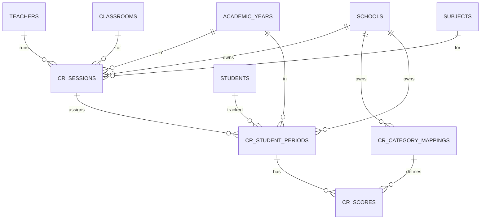
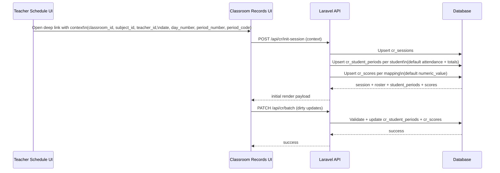

# Classroom Records v1 — Tables, Relations, and Dataflow (cr_*)

This document describes the **new `cr_*` schema** and how data flows from Teacher Schedule into Classroom Records v1.

***

## Core Tables

### `cr_sessions`
Teaching context for a single class slot.
- Links: school/year/teacher/classroom/subject + date + period_code

### `cr_student_periods` (Source of truth)
One row per student per slot for reporting.
- Attendance reporting source: `attendance_status`
- Scoring support: `attendance_score`
- Session total: `total_score`

### `cr_category_mappings`
Admin-defined categories per school (e.g. homework, behavior).

### `cr_scores`
Long-format values: one row per (student_period, category).

***

## period_code (Slot Key)
Canonical format:
- `Y{year_id}-S#-W#-D#-P#`

Example:
- `Y2026-S1-W12-D2-P3`

***

## ER Diagram (cr_*)

***

## Dataflow (Schedule → Records)

***

## Report-Safe Constraints

Critical uniqueness to prevent broken attendance reports:
- `cr_student_periods`:
  - `UNIQUE (school_id, year_id, date, period_code, student_id)`

Rule:
- “Present” reporting uses `attendance_status` (not score).

