# Weekly System V1 - Architecture Diagrams

## 1. High-Level System Architecture

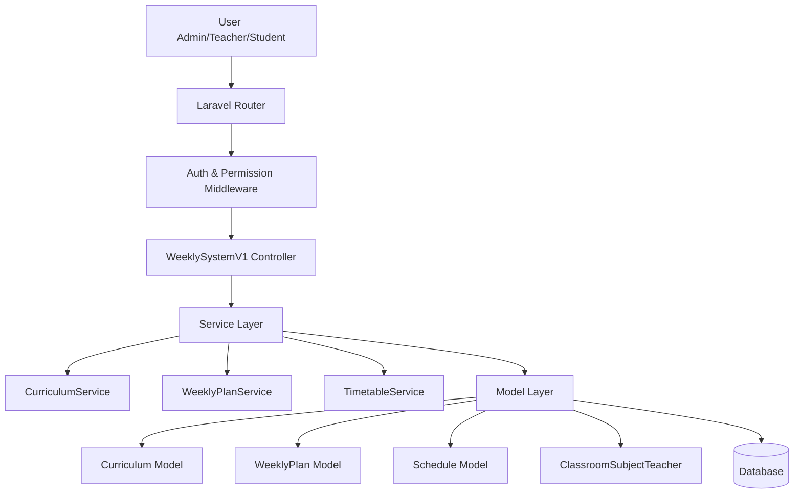

---

## 2. Feature-First Folder Structure

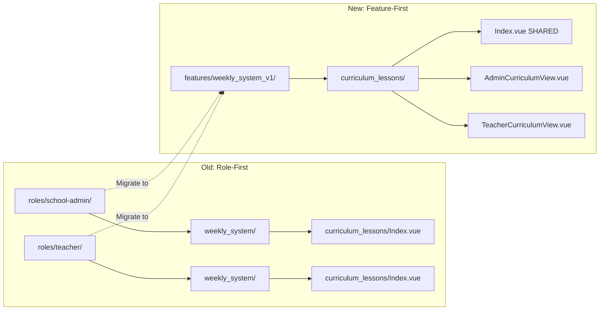

---

## 3. Request Flow - Admin Viewing Curriculum

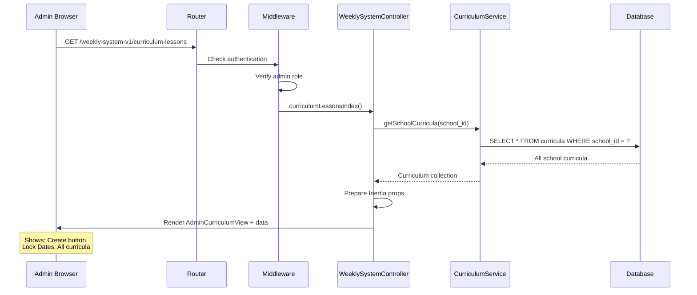

---

## 4. Request Flow - Teacher Viewing Curriculum

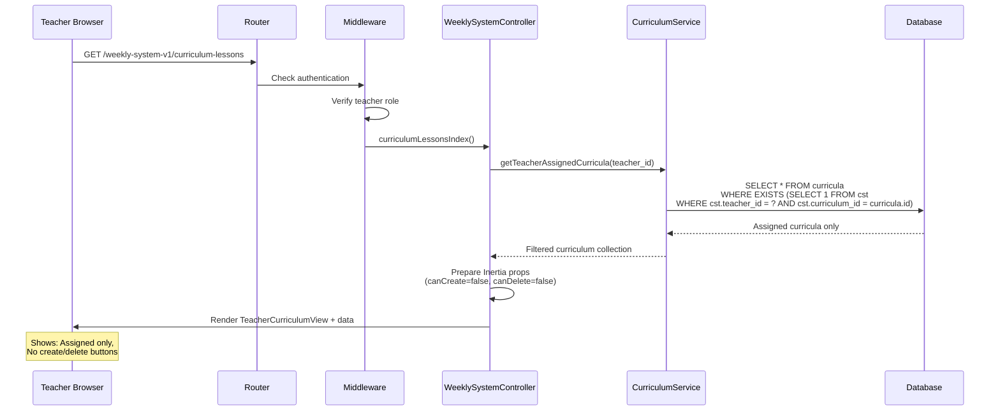

---

## 5. Component Hierarchy

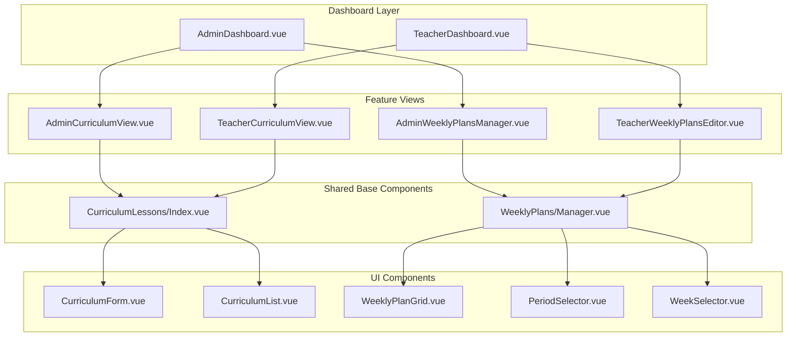

---

## 6. Data Flow - Copy Weekly Plans

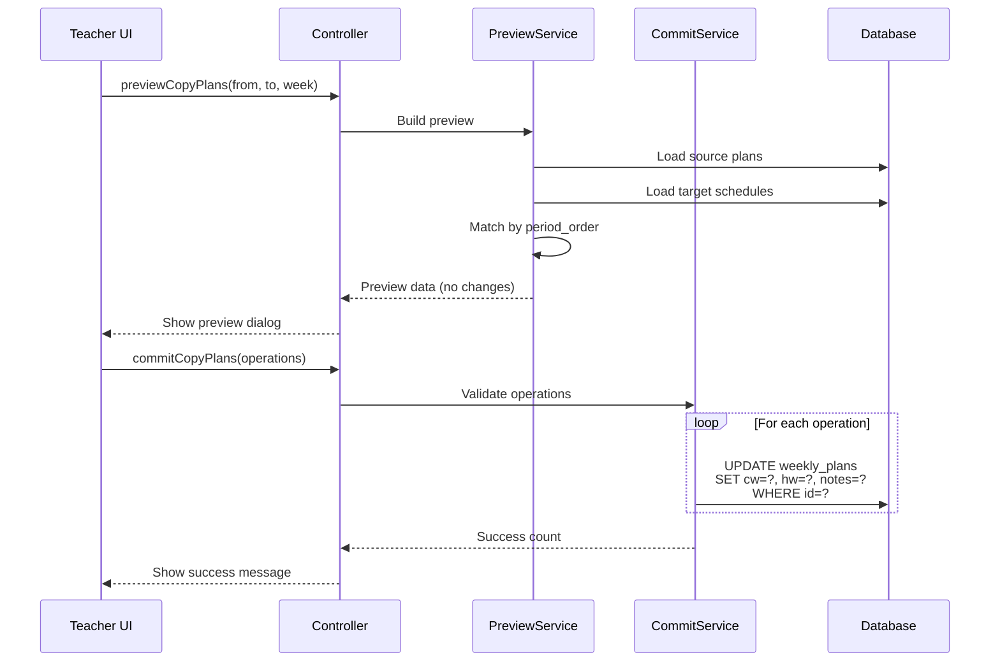

---

## 7. Permission Matrix

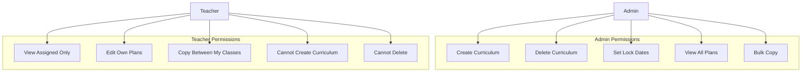

---

## 8. Route Organization

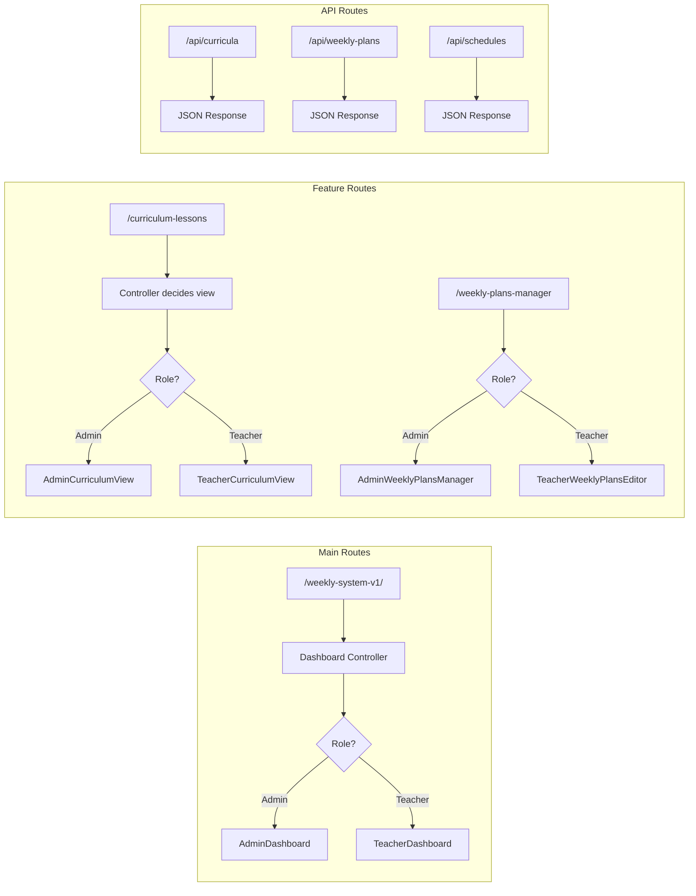

---

## 9. Service Dependencies

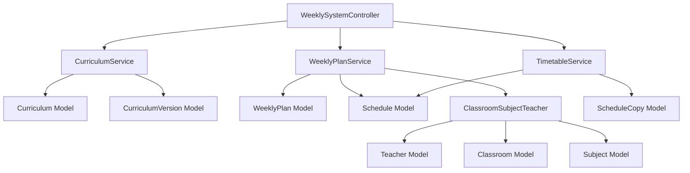

---

## 10. Migration Timeline

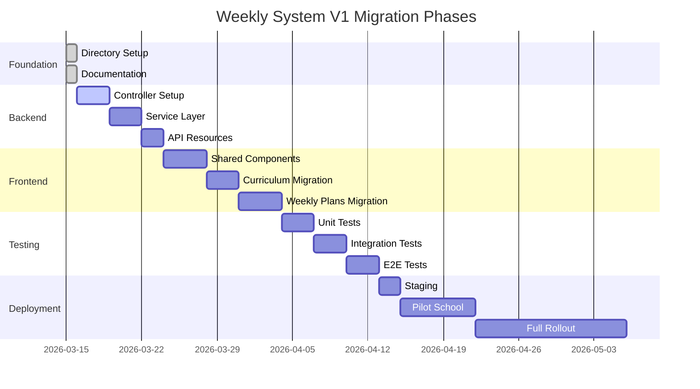

---

## 11. Before/After Code Comparison

### Before: Duplicate Logic

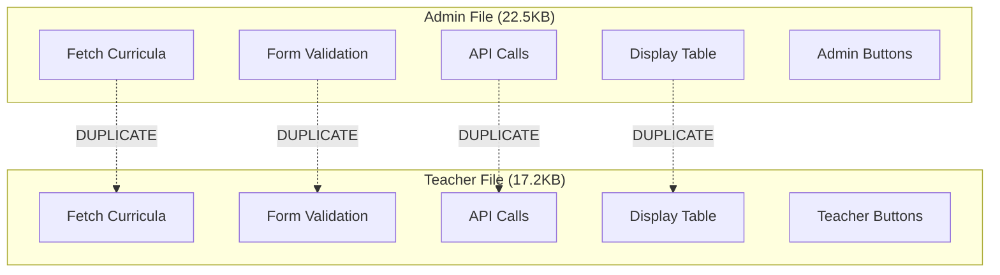

### After: Shared + Wrappers

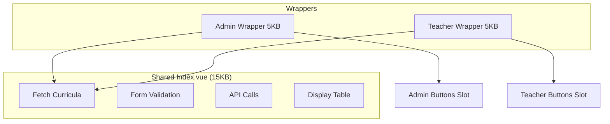

---

## 12. Security Boundaries

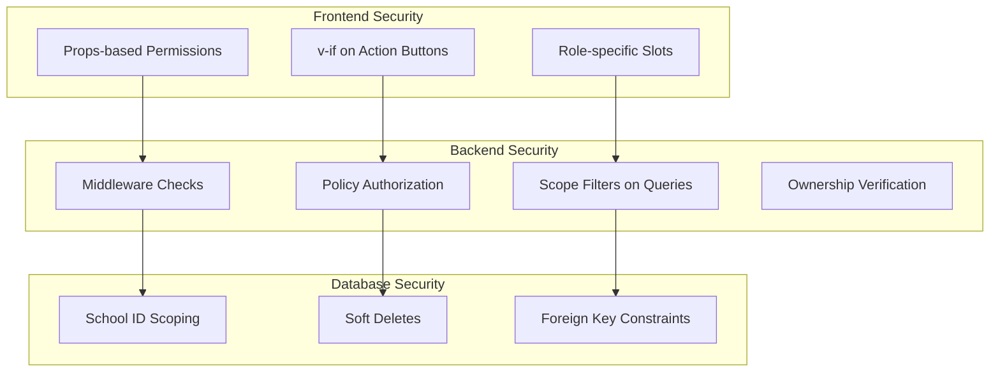

---

These diagrams illustrate the complete architecture of the Weekly System V1 migration from multiple perspectives.
